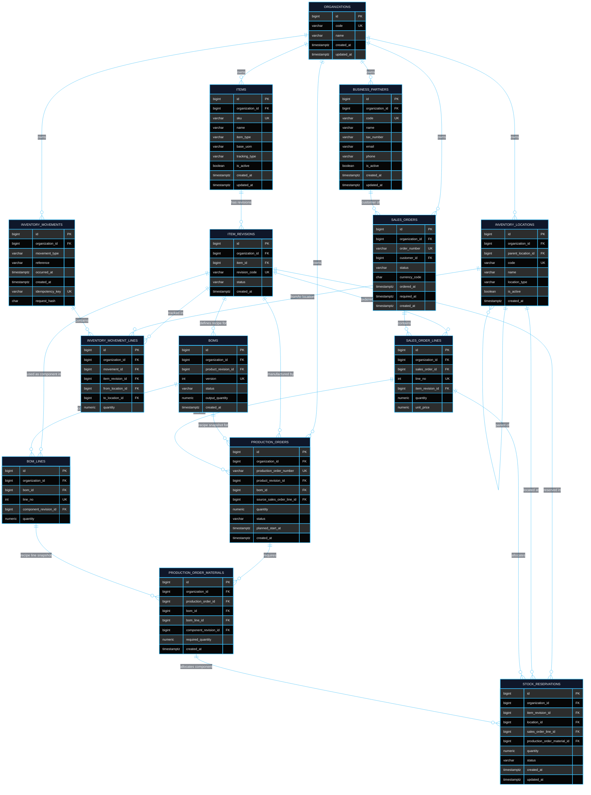

# Database Schema & Technical Data Architecture

This document is the authoritative technical reference for the PostgreSQL 17 relational database powering the **Solar Panel ERP API (v1.0.0)**.

<div style="background: linear-gradient(90deg, rgba(15, 23, 42, 0.98) 0%, rgba(30, 41, 59, 0.9) 60%, rgba(15, 23, 42, 0.98) 100%); border-left: 5px solid #38bdf8; border-top: 1px solid #38bdf866; border-right: 1px solid rgba(255, 255, 255, 0.08); border-bottom: 1px solid #38bdf844; border-radius: 10px; padding: 14px 22px; margin: 38px 0 16px 0; box-shadow: 0 6px 24px rgba(0, 0, 0, 0.6), inset 0 1px 0 rgba(255, 255, 255, 0.15);">
  <h2 style="margin: 0; padding: 0; font-family: 'Inter', -apple-system, BlinkMacSystemFont, sans-serif; font-size: 1.35rem; font-weight: 800; color: #ffffff; letter-spacing: -0.02em; display: flex; align-items: center; justify-content: space-between;">
    <span style="display: flex; align-items: center; gap: 12px;">
      <span style="color: #38bdf8; text-shadow: 0 0 14px #38bdf888;">⚡</span>
      <span style="background: linear-gradient(135deg, #ffffff 40%, #38bdf8 100%); -webkit-background-clip: text; -webkit-text-fill-color: transparent;">1. Architectural Principles & Invariants</span>
    </span>
    <span style="background: rgba(255, 255, 255, 0.06); color: #38bdf8; border: 1px solid #38bdf855; padding: 2px 10px; border-radius: 9999px; font-size: 0.72rem; font-weight: 700; letter-spacing: 0.08em; text-transform: uppercase;">ARCHITECTURE</span>
  </h2>
</div>

The database layer serves as the ultimate source of truth, enforcing business rules directly through PostgreSQL constraints, declarative schema definitions, and transactional triggers:

1. **Multi-Tenant Scoping**: Every business table contains an `organization_id` column. Multi-column composite foreign keys `(organization_id, id)` ensure strict tenant isolation across all relational hierarchies.
2. **Immutable Double-Entry Ledger**: Physical inventory balances are never stored as mutable counter columns. Stock levels are strictly derived from append-only `inventory_movements` and `inventory_movement_lines`.
3. **Derived Real-Time Balance Views**:
   - `inventory_on_hand`: $\text{OnHand} = \text{Incoming} - \text{Outgoing}$.
   - `inventory_availability`: $\text{Available} = \text{OnHand} - \text{ActiveReservations}$.
4. **Reservable Location Invariant**: Only active locations of type `WAREHOUSE`, `BIN`, and `PRODUCTION` are reservable. Quarantine (`QUARANTINE`), damaged (`DAMAGED`), and transit (`TRANSIT`) locations are strictly excluded from available-to-promise calculations.
5. **Traceability (Option A)**: Stock reservations link directly to either a customer order line (`sales_order_line_id`) or a manufacturing requirement (`production_order_material_id`).
6. **Concurrency Protection**: Stock-affecting transactions acquire an advisory transaction lock (`pg_advisory_xact_lock(organization_id)`) under `READ COMMITTED` isolation, eliminating race conditions during concurrent reservation and movement allocation.
7. **Append-Only History Preservation**: Updates and deletions on historical records (`inventory_movements`, `inventory_movement_lines`, `production_order_materials`) are blocked by database triggers (`reject_history_change()`). Reservations transition to `RELEASED` rather than being physically deleted.

<div style="background: linear-gradient(90deg, rgba(15, 23, 42, 0.98) 0%, rgba(30, 41, 59, 0.9) 60%, rgba(15, 23, 42, 0.98) 100%); border-left: 5px solid #38bdf8; border-top: 1px solid #38bdf866; border-right: 1px solid rgba(255, 255, 255, 0.08); border-bottom: 1px solid #38bdf844; border-radius: 10px; padding: 14px 22px; margin: 38px 0 16px 0; box-shadow: 0 6px 24px rgba(0, 0, 0, 0.6), inset 0 1px 0 rgba(255, 255, 255, 0.15);">
  <h2 style="margin: 0; padding: 0; font-family: 'Inter', -apple-system, BlinkMacSystemFont, sans-serif; font-size: 1.35rem; font-weight: 800; color: #ffffff; letter-spacing: -0.02em; display: flex; align-items: center; justify-content: space-between;">
    <span style="display: flex; align-items: center; gap: 12px;">
      <span style="color: #38bdf8; text-shadow: 0 0 14px #38bdf888;">⚡</span>
      <span style="background: linear-gradient(135deg, #ffffff 40%, #38bdf8 100%); -webkit-background-clip: text; -webkit-text-fill-color: transparent;">2. Entity-Relationship Diagram (ERD)</span>
    </span>
    <span style="background: rgba(255, 255, 255, 0.06); color: #38bdf8; border: 1px solid #38bdf855; padding: 2px 10px; border-radius: 9999px; font-size: 0.72rem; font-weight: 700; letter-spacing: 0.08em; text-transform: uppercase;">DATA MODEL</span>
  </h2>
</div>



<div style="background: linear-gradient(90deg, rgba(15, 23, 42, 0.98) 0%, rgba(30, 41, 59, 0.9) 60%, rgba(15, 23, 42, 0.98) 100%); border-left: 5px solid #38bdf8; border-top: 1px solid #38bdf866; border-right: 1px solid rgba(255, 255, 255, 0.08); border-bottom: 1px solid #38bdf844; border-radius: 10px; padding: 14px 22px; margin: 38px 0 16px 0; box-shadow: 0 6px 24px rgba(0, 0, 0, 0.6), inset 0 1px 0 rgba(255, 255, 255, 0.15);">
  <h2 style="margin: 0; padding: 0; font-family: 'Inter', -apple-system, BlinkMacSystemFont, sans-serif; font-size: 1.35rem; font-weight: 800; color: #ffffff; letter-spacing: -0.02em; display: flex; align-items: center; justify-content: space-between;">
    <span style="display: flex; align-items: center; gap: 12px;">
      <span style="color: #38bdf8; text-shadow: 0 0 14px #38bdf888;">⚡</span>
      <span style="background: linear-gradient(135deg, #ffffff 40%, #38bdf8 100%); -webkit-background-clip: text; -webkit-text-fill-color: transparent;">3. Detailed Table Dictionary</span>
    </span>
    <span style="background: rgba(255, 255, 255, 0.06); color: #38bdf8; border: 1px solid #38bdf855; padding: 2px 10px; border-radius: 9999px; font-size: 0.72rem; font-weight: 700; letter-spacing: 0.08em; text-transform: uppercase;">TABLES & SCHEMAS</span>
  </h2>
</div>

<div style="background: linear-gradient(90deg, rgba(15, 23, 42, 0.95) 0%, rgba(30, 41, 59, 0.85) 50%, rgba(15, 23, 42, 0.95) 100%); border-left: 4px solid #38bdf8; border-top: 1px solid #38bdf855; border-right: 1px solid rgba(255, 255, 255, 0.08); border-bottom: 1px solid #38bdf833; border-radius: 8px; padding: 12px 18px; margin: 26px 0 12px 0; box-shadow: 0 4px 18px rgba(0, 0, 0, 0.5), inset 0 1px 0 rgba(255, 255, 255, 0.1);">
  <span style="background: #38bdf8; color: #070b14; font-family: 'JetBrains Mono', monospace; font-size: 1.05rem; font-weight: 800; padding: 3px 10px; border-radius: 5px; box-shadow: 0 0 12px #38bdf866; letter-spacing: -0.01em;">3.1. organizations</span>
  <span style="background: linear-gradient(135deg, #0284c7 0%, #0369a1 100%); color: #ffffff; padding: 3px 9px; border-radius: 4px; font-size: 0.72rem; font-weight: 800; letter-spacing: 0.06em; margin-left: 12px; border: 1px solid rgba(56, 189, 248, 0.6); box-shadow: 0 0 10px rgba(2, 132, 199, 0.45); vertical-align: middle;">TENANT ROOT</span>
  <span style="color: #94a3b8; font-size: 0.88rem; margin-left: 12px; font-weight: 500;">Authoritative enterprise tenant boundary.</span>
</div>


| Column | Type | Constraints & Modifiers | Description |
| :--- | :--- | :--- | :--- |
| <code style="color:#38bdf8;font-weight:700">id</code> | <span style="color:#c084fc;font-weight:600">BIGINT</span> | <span style="background:#78350f;color:#fde68a;padding:1px 6px;border-radius:4px;font-size:0.72rem;font-weight:700">PK</span> <span style="color:#94a3b8;font-size:0.8rem">IDENTITY</span> | Internal unique identifier |
| <code style="color:#38bdf8;font-weight:700">code</code> | <span style="color:#c084fc;font-weight:600">VARCHAR(50)</span> | <span style="background:#064e3b;color:#a7f3d0;padding:1px 6px;border-radius:4px;font-size:0.72rem;font-weight:700">UK</span> <span style="color:#34d399;font-weight:600;font-size:0.8rem">NOT NULL</span> | Unique business code (e.g., `SOLARIA`) |
| <code style="color:#38bdf8;font-weight:700">name</code> | <span style="color:#c084fc;font-weight:600">VARCHAR(255)</span> | <span style="color:#34d399;font-weight:600;font-size:0.8rem">NOT NULL</span> | Legal enterprise / display name |
| <code style="color:#38bdf8;font-weight:700">created_at</code> | <span style="color:#818cf8;font-weight:600">TIMESTAMPTZ</span> | <span style="color:#34d399;font-weight:600;font-size:0.8rem">NOT NULL</span> <span style="color:#fbbf24;font-size:0.8rem">DEFAULT now()</span> | Row creation timestamp |
| <code style="color:#38bdf8;font-weight:700">updated_at</code> | <span style="color:#818cf8;font-weight:600">TIMESTAMPTZ</span> | <span style="color:#34d399;font-weight:600;font-size:0.8rem">NOT NULL</span> <span style="color:#fbbf24;font-size:0.8rem">DEFAULT now()</span> | Last update timestamp |

<div style="background: linear-gradient(90deg, rgba(15, 23, 42, 0.95) 0%, rgba(30, 41, 59, 0.85) 50%, rgba(15, 23, 42, 0.95) 100%); border-left: 4px solid #818cf8; border-top: 1px solid #818cf855; border-right: 1px solid rgba(255, 255, 255, 0.08); border-bottom: 1px solid #818cf833; border-radius: 8px; padding: 12px 18px; margin: 26px 0 12px 0; box-shadow: 0 4px 18px rgba(0, 0, 0, 0.5), inset 0 1px 0 rgba(255, 255, 255, 0.1);">
  <span style="background: #818cf8; color: #070b14; font-family: 'JetBrains Mono', monospace; font-size: 1.05rem; font-weight: 800; padding: 3px 10px; border-radius: 5px; box-shadow: 0 0 12px #818cf866; letter-spacing: -0.01em;">3.2. business_partners</span>
  <span style="background: linear-gradient(135deg, #4f46e5 0%, #3730a3 100%); color: #ffffff; padding: 3px 9px; border-radius: 4px; font-size: 0.72rem; font-weight: 800; letter-spacing: 0.06em; margin-left: 12px; border: 1px solid rgba(129, 140, 248, 0.6); box-shadow: 0 0 10px rgba(79, 70, 229, 0.45); vertical-align: middle;">MASTER ENTITY</span>
  <span style="color: #94a3b8; font-size: 0.88rem; margin-left: 12px; font-weight: 500;">Customers, suppliers, and external counterparties.</span>
</div>


| Column | Type | Constraints & Modifiers | Description |
| :--- | :--- | :--- | :--- |
| <code style="color:#38bdf8;font-weight:700">id</code> | <span style="color:#c084fc;font-weight:600">BIGINT</span> | <span style="background:#78350f;color:#fde68a;padding:1px 6px;border-radius:4px;font-size:0.72rem;font-weight:700">PK</span> <span style="color:#94a3b8;font-size:0.8rem">IDENTITY</span> | Internal unique identifier |
| <code style="color:#38bdf8;font-weight:700">organization_id</code> | <span style="color:#c084fc;font-weight:600">BIGINT</span> | <span style="background:#581c87;color:#e9d5ff;padding:1px 6px;border-radius:4px;font-size:0.72rem;font-weight:700">FK</span> <span style="color:#34d399;font-weight:600;font-size:0.8rem">NOT NULL</span> &rarr; `organizations(id)` | Owning tenant boundary |
| <code style="color:#38bdf8;font-weight:700">code</code> | <span style="color:#c084fc;font-weight:600">VARCHAR(50)</span> | <span style="background:#064e3b;color:#a7f3d0;padding:1px 6px;border-radius:4px;font-size:0.72rem;font-weight:700">UK</span> <span style="color:#34d399;font-weight:600;font-size:0.8rem">NOT NULL</span> (per org) | Tenant-unique partner code (e.g., `HELIOS`) |
| <code style="color:#38bdf8;font-weight:700">name</code> | <span style="color:#c084fc;font-weight:600">VARCHAR(255)</span> | <span style="color:#34d399;font-weight:600;font-size:0.8rem">NOT NULL</span> | Partner legal name |
| <code style="color:#38bdf8;font-weight:700">tax_number</code> | <span style="color:#c084fc;font-weight:600">VARCHAR(50)</span> | <span style="color:#94a3b8;font-size:0.8rem">NULLABLE</span> | Tax registration / VAT identifier |
| <code style="color:#38bdf8;font-weight:700">email</code> | <span style="color:#c084fc;font-weight:600">VARCHAR(255)</span> | <span style="color:#94a3b8;font-size:0.8rem">NULLABLE</span> | Primary contact email |
| <code style="color:#38bdf8;font-weight:700">phone</code> | <span style="color:#c084fc;font-weight:600">VARCHAR(50)</span> | <span style="color:#94a3b8;font-size:0.8rem">NULLABLE</span> | Contact telephone number |
| <code style="color:#38bdf8;font-weight:700">is_active</code> | <span style="color:#f472b6;font-weight:600">BOOLEAN</span> | <span style="color:#34d399;font-weight:600;font-size:0.8rem">NOT NULL</span> <span style="color:#fbbf24;font-size:0.8rem">DEFAULT true</span> | Operational activity status |
| <code style="color:#38bdf8;font-weight:700">created_at</code> | <span style="color:#818cf8;font-weight:600">TIMESTAMPTZ</span> | <span style="color:#34d399;font-weight:600;font-size:0.8rem">NOT NULL</span> <span style="color:#fbbf24;font-size:0.8rem">DEFAULT now()</span> | Row creation timestamp |
| <code style="color:#38bdf8;font-weight:700">updated_at</code> | <span style="color:#818cf8;font-weight:600">TIMESTAMPTZ</span> | <span style="color:#34d399;font-weight:600;font-size:0.8rem">NOT NULL</span> <span style="color:#fbbf24;font-size:0.8rem">DEFAULT now()</span> | Last update timestamp |

<div style="background: linear-gradient(90deg, rgba(15, 23, 42, 0.95) 0%, rgba(30, 41, 59, 0.85) 50%, rgba(15, 23, 42, 0.95) 100%); border-left: 4px solid #38bdf8; border-top: 1px solid #38bdf855; border-right: 1px solid rgba(255, 255, 255, 0.08); border-bottom: 1px solid #38bdf833; border-radius: 8px; padding: 12px 18px; margin: 26px 0 12px 0; box-shadow: 0 4px 18px rgba(0, 0, 0, 0.5), inset 0 1px 0 rgba(255, 255, 255, 0.1);">
  <span style="background: #38bdf8; color: #070b14; font-family: 'JetBrains Mono', monospace; font-size: 1.05rem; font-weight: 800; padding: 3px 10px; border-radius: 5px; box-shadow: 0 0 12px #38bdf866; letter-spacing: -0.01em;">3.3. items</span>
  <span style="background: linear-gradient(135deg, #0284c7 0%, #0369a1 100%); color: #ffffff; padding: 3px 9px; border-radius: 4px; font-size: 0.72rem; font-weight: 800; letter-spacing: 0.06em; margin-left: 12px; border: 1px solid rgba(56, 189, 248, 0.6); box-shadow: 0 0 10px rgba(2, 132, 199, 0.45); vertical-align: middle;">PRODUCT CATALOG</span>
  <span style="color: #94a3b8; font-size: 0.88rem; margin-left: 12px; font-weight: 500;">Catalog master data describing what a product or component is.</span>
</div>


| Column | Type | Constraints & Modifiers | Description |
| :--- | :--- | :--- | :--- |
| <code style="color:#38bdf8;font-weight:700">id</code> | <span style="color:#c084fc;font-weight:600">BIGINT</span> | <span style="background:#78350f;color:#fde68a;padding:1px 6px;border-radius:4px;font-size:0.72rem;font-weight:700">PK</span> <span style="color:#94a3b8;font-size:0.8rem">IDENTITY</span> | Internal unique identifier |
| <code style="color:#38bdf8;font-weight:700">organization_id</code> | <span style="color:#c084fc;font-weight:600">BIGINT</span> | <span style="background:#581c87;color:#e9d5ff;padding:1px 6px;border-radius:4px;font-size:0.72rem;font-weight:700">FK</span> <span style="color:#34d399;font-weight:600;font-size:0.8rem">NOT NULL</span> &rarr; `organizations(id)` | Owning tenant boundary |
| <code style="color:#38bdf8;font-weight:700">sku</code> | <span style="color:#c084fc;font-weight:600">VARCHAR(100)</span> | <span style="background:#064e3b;color:#a7f3d0;padding:1px 6px;border-radius:4px;font-size:0.72rem;font-weight:700">UK</span> <span style="color:#34d399;font-weight:600;font-size:0.8rem">NOT NULL</span> (per org) | Stock Keeping Unit code (e.g., `PV-550`, `CELL-M10`) |
| <code style="color:#38bdf8;font-weight:700">name</code> | <span style="color:#c084fc;font-weight:600">VARCHAR(255)</span> | <span style="color:#34d399;font-weight:600;font-size:0.8rem">NOT NULL</span> | Item commercial name |
| <code style="color:#38bdf8;font-weight:700">item_type</code> | <span style="color:#c084fc;font-weight:600">VARCHAR(30)</span> | <span style="color:#34d399;font-weight:600;font-size:0.8rem">NOT NULL</span> <span style="color:#fb7185;font-size:0.8rem">CHECK</span> (`MATERIAL`, `COMPONENT`, `FINISHED_GOOD`) | Material taxonomy |
| <code style="color:#38bdf8;font-weight:700">base_uom</code> | <span style="color:#c084fc;font-weight:600">VARCHAR(20)</span> | <span style="color:#34d399;font-weight:600;font-size:0.8rem">NOT NULL</span> | Base unit of measure (`EA`, `M2`, `KG`) |
| <code style="color:#38bdf8;font-weight:700">tracking_type</code> | <span style="color:#c084fc;font-weight:600">VARCHAR(20)</span> | <span style="color:#34d399;font-weight:600;font-size:0.8rem">NOT NULL</span> <span style="color:#fbbf24;font-size:0.8rem">DEFAULT 'NONE'</span> <span style="color:#fb7185;font-size:0.8rem">CHECK</span> (`NONE`, `LOT`, `SERIAL`) | Traceability tracking level |
| <code style="color:#38bdf8;font-weight:700">is_active</code> | <span style="color:#f472b6;font-weight:600">BOOLEAN</span> | <span style="color:#34d399;font-weight:600;font-size:0.8rem">NOT NULL</span> <span style="color:#fbbf24;font-size:0.8rem">DEFAULT true</span> | Catalog availability status |
| <code style="color:#38bdf8;font-weight:700">created_at</code> | <span style="color:#818cf8;font-weight:600">TIMESTAMPTZ</span> | <span style="color:#34d399;font-weight:600;font-size:0.8rem">NOT NULL</span> <span style="color:#fbbf24;font-size:0.8rem">DEFAULT now()</span> | Row creation timestamp |
| <code style="color:#38bdf8;font-weight:700">updated_at</code> | <span style="color:#818cf8;font-weight:600">TIMESTAMPTZ</span> | <span style="color:#34d399;font-weight:600;font-size:0.8rem">NOT NULL</span> <span style="color:#fbbf24;font-size:0.8rem">DEFAULT now()</span> | Last update timestamp |

<div style="background: linear-gradient(90deg, rgba(15, 23, 42, 0.95) 0%, rgba(30, 41, 59, 0.85) 50%, rgba(15, 23, 42, 0.95) 100%); border-left: 4px solid #c084fc; border-top: 1px solid #c084fc55; border-right: 1px solid rgba(255, 255, 255, 0.08); border-bottom: 1px solid #c084fc33; border-radius: 8px; padding: 12px 18px; margin: 26px 0 12px 0; box-shadow: 0 4px 18px rgba(0, 0, 0, 0.5), inset 0 1px 0 rgba(255, 255, 255, 0.1);">
  <span style="background: #c084fc; color: #070b14; font-family: 'JetBrains Mono', monospace; font-size: 1.05rem; font-weight: 800; padding: 3px 10px; border-radius: 5px; box-shadow: 0 0 12px #c084fc66; letter-spacing: -0.01em;">3.4. item_revisions</span>
  <span style="background: linear-gradient(135deg, #7e22ce 0%, #581c87 100%); color: #ffffff; padding: 3px 9px; border-radius: 4px; font-size: 0.72rem; font-weight: 800; letter-spacing: 0.06em; margin-left: 12px; border: 1px solid rgba(192, 132, 252, 0.6); box-shadow: 0 0 10px rgba(126, 34, 206, 0.45); vertical-align: middle;">IMMUTABLE REVISIONS</span>
  <span style="color: #94a3b8; font-size: 0.88rem; margin-left: 12px; font-weight: 500;">Versioned, immutable specifications of catalog items (e.g., REV-A, REV-B).</span>
</div>


| Column | Type | Constraints & Modifiers | Description |
| :--- | :--- | :--- | :--- |
| <code style="color:#38bdf8;font-weight:700">id</code> | <span style="color:#c084fc;font-weight:600">BIGINT</span> | <span style="background:#78350f;color:#fde68a;padding:1px 6px;border-radius:4px;font-size:0.72rem;font-weight:700">PK</span> <span style="color:#94a3b8;font-size:0.8rem">IDENTITY</span> | Internal unique identifier |
| <code style="color:#38bdf8;font-weight:700">organization_id</code> | <span style="color:#c084fc;font-weight:600">BIGINT</span> | <span style="background:#581c87;color:#e9d5ff;padding:1px 6px;border-radius:4px;font-size:0.72rem;font-weight:700">FK</span> <span style="color:#34d399;font-weight:600;font-size:0.8rem">NOT NULL</span> &rarr; `organizations(id)` | Owning tenant boundary |
| <code style="color:#38bdf8;font-weight:700">item_id</code> | <span style="color:#c084fc;font-weight:600">BIGINT</span> | <span style="background:#581c87;color:#e9d5ff;padding:1px 6px;border-radius:4px;font-size:0.72rem;font-weight:700">FK</span> <span style="color:#34d399;font-weight:600;font-size:0.8rem">NOT NULL</span> &rarr; `items(organization_id, id)` | Parent catalog item |
| <code style="color:#38bdf8;font-weight:700">revision_code</code> | <span style="color:#c084fc;font-weight:600">VARCHAR(50)</span> | <span style="background:#064e3b;color:#a7f3d0;padding:1px 6px;border-radius:4px;font-size:0.72rem;font-weight:700">UK</span> <span style="color:#34d399;font-weight:600;font-size:0.8rem">NOT NULL</span> (per item) | Revision identifier (e.g., `REV-A`) |
| <code style="color:#38bdf8;font-weight:700">status</code> | <span style="color:#c084fc;font-weight:600">VARCHAR(20)</span> | <span style="color:#34d399;font-weight:600;font-size:0.8rem">NOT NULL</span> <span style="color:#fbbf24;font-size:0.8rem">DEFAULT 'DRAFT'</span> <span style="color:#fb7185;font-size:0.8rem">CHECK</span> (`DRAFT`, `ACTIVE`, `OBSOLETE`) | Engineering lifecycle status |
| <code style="color:#38bdf8;font-weight:700">created_at</code> | <span style="color:#818cf8;font-weight:600">TIMESTAMPTZ</span> | <span style="color:#34d399;font-weight:600;font-size:0.8rem">NOT NULL</span> <span style="color:#fbbf24;font-size:0.8rem">DEFAULT now()</span> | Row creation timestamp |

<div style="background: linear-gradient(90deg, rgba(15, 23, 42, 0.95) 0%, rgba(30, 41, 59, 0.85) 50%, rgba(15, 23, 42, 0.95) 100%); border-left: 4px solid #fb7185; border-top: 1px solid #fb718555; border-right: 1px solid rgba(255, 255, 255, 0.08); border-bottom: 1px solid #fb718533; border-radius: 8px; padding: 12px 18px; margin: 26px 0 12px 0; box-shadow: 0 4px 18px rgba(0, 0, 0, 0.5), inset 0 1px 0 rgba(255, 255, 255, 0.1);">
  <span style="background: #fb7185; color: #070b14; font-family: 'JetBrains Mono', monospace; font-size: 1.05rem; font-weight: 800; padding: 3px 10px; border-radius: 5px; box-shadow: 0 0 12px #fb718566; letter-spacing: -0.01em;">3.5. boms</span>
  <span style="background: linear-gradient(135deg, #be123c 0%, #881337 100%); color: #ffffff; padding: 3px 9px; border-radius: 4px; font-size: 0.72rem; font-weight: 800; letter-spacing: 0.06em; margin-left: 12px; border: 1px solid rgba(251, 113, 133, 0.6); box-shadow: 0 0 10px rgba(190, 18, 60, 0.45); vertical-align: middle;">RECIPE HEADERS</span>
  <span style="color: #94a3b8; font-size: 0.88rem; margin-left: 12px; font-weight: 500;">Bill of Materials recipe defining required components for a finished panel revision.</span>
</div>


| Column | Type | Constraints & Modifiers | Description |
| :--- | :--- | :--- | :--- |
| <code style="color:#38bdf8;font-weight:700">id</code> | <span style="color:#c084fc;font-weight:600">BIGINT</span> | <span style="background:#78350f;color:#fde68a;padding:1px 6px;border-radius:4px;font-size:0.72rem;font-weight:700">PK</span> <span style="color:#94a3b8;font-size:0.8rem">IDENTITY</span> | Internal unique identifier |
| <code style="color:#38bdf8;font-weight:700">organization_id</code> | <span style="color:#c084fc;font-weight:600">BIGINT</span> | <span style="background:#581c87;color:#e9d5ff;padding:1px 6px;border-radius:4px;font-size:0.72rem;font-weight:700">FK</span> <span style="color:#34d399;font-weight:600;font-size:0.8rem">NOT NULL</span> &rarr; `organizations(id)` | Owning tenant boundary |
| <code style="color:#38bdf8;font-weight:700">product_revision_id</code> | <span style="color:#c084fc;font-weight:600">BIGINT</span> | <span style="background:#581c87;color:#e9d5ff;padding:1px 6px;border-radius:4px;font-size:0.72rem;font-weight:700">FK</span> <span style="color:#34d399;font-weight:600;font-size:0.8rem">NOT NULL</span> &rarr; `item_revisions(organization_id, id)` | Finished good panel revision |
| <code style="color:#38bdf8;font-weight:700">version</code> | <span style="color:#38bdf8;font-weight:600">INTEGER</span> | <span style="background:#064e3b;color:#a7f3d0;padding:1px 6px;border-radius:4px;font-size:0.72rem;font-weight:700">UK</span> <span style="color:#34d399;font-weight:600;font-size:0.8rem">NOT NULL</span> <span style="color:#fb7185;font-size:0.8rem">CHECK (version > 0)</span> | Sequential recipe version |
| <code style="color:#38bdf8;font-weight:700">status</code> | <span style="color:#c084fc;font-weight:600">VARCHAR(20)</span> | <span style="color:#34d399;font-weight:600;font-size:0.8rem">NOT NULL</span> <span style="color:#fbbf24;font-size:0.8rem">DEFAULT 'DRAFT'</span> <span style="color:#fb7185;font-size:0.8rem">CHECK</span> (`DRAFT`, `ACTIVE`, `OBSOLETE`) | Recipe lifecycle status |
| <code style="color:#38bdf8;font-weight:700">output_quantity</code> | <span style="color:#fb923c;font-weight:600">NUMERIC(18,6)</span> | <span style="color:#34d399;font-weight:600;font-size:0.8rem">NOT NULL</span> <span style="color:#fb7185;font-size:0.8rem">CHECK (output_quantity > 0)</span> | Yield batch quantity produced |
| <code style="color:#38bdf8;font-weight:700">created_at</code> | <span style="color:#818cf8;font-weight:600">TIMESTAMPTZ</span> | <span style="color:#34d399;font-weight:600;font-size:0.8rem">NOT NULL</span> <span style="color:#fbbf24;font-size:0.8rem">DEFAULT now()</span> | Recipe creation timestamp |

<div style="background: linear-gradient(90deg, rgba(15, 23, 42, 0.95) 0%, rgba(30, 41, 59, 0.85) 50%, rgba(15, 23, 42, 0.95) 100%); border-left: 4px solid #fb7185; border-top: 1px solid #fb718555; border-right: 1px solid rgba(255, 255, 255, 0.08); border-bottom: 1px solid #fb718533; border-radius: 8px; padding: 12px 18px; margin: 26px 0 12px 0; box-shadow: 0 4px 18px rgba(0, 0, 0, 0.5), inset 0 1px 0 rgba(255, 255, 255, 0.1);">
  <span style="background: #fb7185; color: #070b14; font-family: 'JetBrains Mono', monospace; font-size: 1.05rem; font-weight: 800; padding: 3px 10px; border-radius: 5px; box-shadow: 0 0 12px #fb718566; letter-spacing: -0.01em;">3.6. bom_lines</span>
  <span style="background: linear-gradient(135deg, #be123c 0%, #881337 100%); color: #ffffff; padding: 3px 9px; border-radius: 4px; font-size: 0.72rem; font-weight: 800; letter-spacing: 0.06em; margin-left: 12px; border: 1px solid rgba(251, 113, 133, 0.6); box-shadow: 0 0 10px rgba(190, 18, 60, 0.45); vertical-align: middle;">RECIPE COMPONENTS</span>
  <span style="color: #94a3b8; font-size: 0.88rem; margin-left: 12px; font-weight: 500;">Specific component revisions and gross quantities required per BOM output unit.</span>
</div>


| Column | Type | Constraints & Modifiers | Description |
| :--- | :--- | :--- | :--- |
| <code style="color:#38bdf8;font-weight:700">id</code> | <span style="color:#c084fc;font-weight:600">BIGINT</span> | <span style="background:#78350f;color:#fde68a;padding:1px 6px;border-radius:4px;font-size:0.72rem;font-weight:700">PK</span> <span style="color:#94a3b8;font-size:0.8rem">IDENTITY</span> | Internal unique identifier |
| <code style="color:#38bdf8;font-weight:700">organization_id</code> | <span style="color:#c084fc;font-weight:600">BIGINT</span> | <span style="background:#581c87;color:#e9d5ff;padding:1px 6px;border-radius:4px;font-size:0.72rem;font-weight:700">FK</span> <span style="color:#34d399;font-weight:600;font-size:0.8rem">NOT NULL</span> &rarr; `organizations(id)` | Owning tenant boundary |
| <code style="color:#38bdf8;font-weight:700">bom_id</code> | <span style="color:#c084fc;font-weight:600">BIGINT</span> | <span style="background:#581c87;color:#e9d5ff;padding:1px 6px;border-radius:4px;font-size:0.72rem;font-weight:700">FK</span> <span style="color:#34d399;font-weight:600;font-size:0.8rem">NOT NULL</span> &rarr; `boms(organization_id, id)` | Parent BOM recipe |
| <code style="color:#38bdf8;font-weight:700">line_no</code> | <span style="color:#38bdf8;font-weight:600">INTEGER</span> | <span style="background:#064e3b;color:#a7f3d0;padding:1px 6px;border-radius:4px;font-size:0.72rem;font-weight:700">UK</span> <span style="color:#34d399;font-weight:600;font-size:0.8rem">NOT NULL</span> (per BOM) <span style="color:#fb7185;font-size:0.8rem">CHECK (line_no > 0)</span> | Recipe sequence position |
| <code style="color:#38bdf8;font-weight:700">component_revision_id</code> | <span style="color:#c084fc;font-weight:600">BIGINT</span> | <span style="background:#581c87;color:#e9d5ff;padding:1px 6px;border-radius:4px;font-size:0.72rem;font-weight:700">FK</span> <span style="color:#34d399;font-weight:600;font-size:0.8rem">NOT NULL</span> &rarr; `item_revisions(organization_id, id)` | Required raw material component |
| <code style="color:#38bdf8;font-weight:700">quantity</code> | <span style="color:#fb923c;font-weight:600">NUMERIC(18,6)</span> | <span style="color:#34d399;font-weight:600;font-size:0.8rem">NOT NULL</span> <span style="color:#fb7185;font-size:0.8rem">CHECK (quantity > 0)</span> | Required gross quantity per recipe output |

<div style="background: linear-gradient(90deg, rgba(15, 23, 42, 0.95) 0%, rgba(30, 41, 59, 0.85) 50%, rgba(15, 23, 42, 0.95) 100%); border-left: 4px solid #34d399; border-top: 1px solid #34d39955; border-right: 1px solid rgba(255, 255, 255, 0.08); border-bottom: 1px solid #34d39933; border-radius: 8px; padding: 12px 18px; margin: 26px 0 12px 0; box-shadow: 0 4px 18px rgba(0, 0, 0, 0.5), inset 0 1px 0 rgba(255, 255, 255, 0.1);">
  <span style="background: #34d399; color: #070b14; font-family: 'JetBrains Mono', monospace; font-size: 1.05rem; font-weight: 800; padding: 3px 10px; border-radius: 5px; box-shadow: 0 0 12px #34d39966; letter-spacing: -0.01em;">3.7. inventory_locations</span>
  <span style="background: linear-gradient(135deg, #059669 0%, #064e3b 100%); color: #ffffff; padding: 3px 9px; border-radius: 4px; font-size: 0.72rem; font-weight: 800; letter-spacing: 0.06em; margin-left: 12px; border: 1px solid rgba(52, 211, 153, 0.6); box-shadow: 0 0 10px rgba(5, 150, 105, 0.45); vertical-align: middle;">WAREHOUSE HIERARCHY</span>
  <span style="color: #94a3b8; font-size: 0.88rem; margin-left: 12px; font-weight: 500;">Physical and logical stock storage locations with explicit operational types.</span>
</div>


| Column | Type | Constraints & Modifiers | Description |
| :--- | :--- | :--- | :--- |
| <code style="color:#38bdf8;font-weight:700">id</code> | <span style="color:#c084fc;font-weight:600">BIGINT</span> | <span style="background:#78350f;color:#fde68a;padding:1px 6px;border-radius:4px;font-size:0.72rem;font-weight:700">PK</span> <span style="color:#94a3b8;font-size:0.8rem">IDENTITY</span> | Internal unique identifier |
| <code style="color:#38bdf8;font-weight:700">organization_id</code> | <span style="color:#c084fc;font-weight:600">BIGINT</span> | <span style="background:#581c87;color:#e9d5ff;padding:1px 6px;border-radius:4px;font-size:0.72rem;font-weight:700">FK</span> <span style="color:#34d399;font-weight:600;font-size:0.8rem">NOT NULL</span> &rarr; `organizations(id)` | Owning tenant boundary |
| <code style="color:#38bdf8;font-weight:700">parent_location_id</code> | <span style="color:#c084fc;font-weight:600">BIGINT</span> | <span style="background:#581c87;color:#e9d5ff;padding:1px 6px;border-radius:4px;font-size:0.72rem;font-weight:700">FK</span> <span style="color:#94a3b8;font-size:0.8rem">NULLABLE</span> &rarr; `inventory_locations(organization_id, id)` | Recursive parent location |
| <code style="color:#38bdf8;font-weight:700">code</code> | <span style="color:#c084fc;font-weight:600">VARCHAR(50)</span> | <span style="background:#064e3b;color:#a7f3d0;padding:1px 6px;border-radius:4px;font-size:0.72rem;font-weight:700">UK</span> <span style="color:#34d399;font-weight:600;font-size:0.8rem">NOT NULL</span> (per org) | Location code (e.g., `RAW-WH`, `QA-HOLD`) |
| <code style="color:#38bdf8;font-weight:700">name</code> | <span style="color:#c084fc;font-weight:600">VARCHAR(255)</span> | <span style="color:#34d399;font-weight:600;font-size:0.8rem">NOT NULL</span> | Display location name |
| <code style="color:#38bdf8;font-weight:700">location_type</code> | <span style="color:#c084fc;font-weight:600">VARCHAR(30)</span> | <span style="color:#34d399;font-weight:600;font-size:0.8rem">NOT NULL</span> <span style="color:#fbbf24;font-size:0.8rem">DEFAULT 'WAREHOUSE'</span> <span style="color:#fb7185;font-size:0.8rem">CHECK</span> (`WAREHOUSE`, `BIN`, `PRODUCTION`, `QUARANTINE`, `DAMAGED`, `TRANSIT`) | Quality & reservability classification |
| <code style="color:#38bdf8;font-weight:700">is_active</code> | <span style="color:#f472b6;font-weight:600">BOOLEAN</span> | <span style="color:#34d399;font-weight:600;font-size:0.8rem">NOT NULL</span> <span style="color:#fbbf24;font-size:0.8rem">DEFAULT true</span> | Operational activity status |
| <code style="color:#38bdf8;font-weight:700">created_at</code> | <span style="color:#818cf8;font-weight:600">TIMESTAMPTZ</span> | <span style="color:#34d399;font-weight:600;font-size:0.8rem">NOT NULL</span> <span style="color:#fbbf24;font-size:0.8rem">DEFAULT now()</span> | Row creation timestamp |

<div style="background: linear-gradient(90deg, rgba(15, 23, 42, 0.95) 0%, rgba(30, 41, 59, 0.85) 50%, rgba(15, 23, 42, 0.95) 100%); border-left: 4px solid #34d399; border-top: 1px solid #34d39955; border-right: 1px solid rgba(255, 255, 255, 0.08); border-bottom: 1px solid #34d39933; border-radius: 8px; padding: 12px 18px; margin: 26px 0 12px 0; box-shadow: 0 4px 18px rgba(0, 0, 0, 0.5), inset 0 1px 0 rgba(255, 255, 255, 0.1);">
  <span style="background: #34d399; color: #070b14; font-family: 'JetBrains Mono', monospace; font-size: 1.05rem; font-weight: 800; padding: 3px 10px; border-radius: 5px; box-shadow: 0 0 12px #34d39966; letter-spacing: -0.01em;">3.8. inventory_movements</span>
  <span style="background: linear-gradient(135deg, #059669 0%, #064e3b 100%); color: #ffffff; padding: 3px 9px; border-radius: 4px; font-size: 0.72rem; font-weight: 800; letter-spacing: 0.06em; margin-left: 12px; border: 1px solid rgba(52, 211, 153, 0.6); box-shadow: 0 0 10px rgba(5, 150, 105, 0.45); vertical-align: middle;">PHYSICAL LEDGER HEADERS</span>
  <span style="color: #94a3b8; font-size: 0.88rem; margin-left: 12px; font-weight: 500;">Append-only physical stock transaction headers.</span>
</div>


| Column | Type | Constraints & Modifiers | Description |
| :--- | :--- | :--- | :--- |
| <code style="color:#38bdf8;font-weight:700">id</code> | <span style="color:#c084fc;font-weight:600">BIGINT</span> | <span style="background:#78350f;color:#fde68a;padding:1px 6px;border-radius:4px;font-size:0.72rem;font-weight:700">PK</span> <span style="color:#94a3b8;font-size:0.8rem">IDENTITY</span> | Internal unique identifier |
| <code style="color:#38bdf8;font-weight:700">organization_id</code> | <span style="color:#c084fc;font-weight:600">BIGINT</span> | <span style="background:#581c87;color:#e9d5ff;padding:1px 6px;border-radius:4px;font-size:0.72rem;font-weight:700">FK</span> <span style="color:#34d399;font-weight:600;font-size:0.8rem">NOT NULL</span> &rarr; `organizations(id)` | Owning tenant boundary |
| <code style="color:#38bdf8;font-weight:700">movement_type</code> | <span style="color:#c084fc;font-weight:600">VARCHAR(40)</span> | <span style="color:#34d399;font-weight:600;font-size:0.8rem">NOT NULL</span> <span style="color:#fb7185;font-size:0.8rem">CHECK</span> (`RECEIPT`, `TRANSFER`, `ADJUSTMENT_IN`, `ADJUSTMENT_OUT`, `ADJUSTMENT`, `PRODUCTION_CONSUMPTION`, `PRODUCTION_OUTPUT`, `SHIPMENT`) | Movement business type |
| <code style="color:#38bdf8;font-weight:700">reference</code> | <span style="color:#c084fc;font-weight:600">VARCHAR(100)</span> | <span style="color:#94a3b8;font-size:0.8rem">NULLABLE</span> | External reference / document number |
| <code style="color:#38bdf8;font-weight:700">occurred_at</code> | <span style="color:#818cf8;font-weight:600">TIMESTAMPTZ</span> | <span style="color:#34d399;font-weight:600;font-size:0.8rem">NOT NULL</span> <span style="color:#fbbf24;font-size:0.8rem">DEFAULT now()</span> | Physical execution timestamp |
| <code style="color:#38bdf8;font-weight:700">created_at</code> | <span style="color:#818cf8;font-weight:600">TIMESTAMPTZ</span> | <span style="color:#34d399;font-weight:600;font-size:0.8rem">NOT NULL</span> <span style="color:#fbbf24;font-size:0.8rem">DEFAULT now()</span> | System insertion timestamp |
| <code style="color:#38bdf8;font-weight:700">idempotency_key</code> | <span style="color:#c084fc;font-weight:600">VARCHAR(100)</span> | <span style="background:#064e3b;color:#a7f3d0;padding:1px 6px;border-radius:4px;font-size:0.72rem;font-weight:700">UK</span> <span style="color:#94a3b8;font-size:0.8rem">NULLABLE</span> (per org) | Safe-retry deduplication key |
| <code style="color:#38bdf8;font-weight:700">request_hash</code> | <span style="color:#c084fc;font-weight:600">CHAR(64)</span> | <span style="color:#94a3b8;font-size:0.8rem">NULLABLE</span> | SHA-256 request fingerprint |

<div style="background: linear-gradient(90deg, rgba(15, 23, 42, 0.95) 0%, rgba(30, 41, 59, 0.85) 50%, rgba(15, 23, 42, 0.95) 100%); border-left: 4px solid #34d399; border-top: 1px solid #34d39955; border-right: 1px solid rgba(255, 255, 255, 0.08); border-bottom: 1px solid #34d39933; border-radius: 8px; padding: 12px 18px; margin: 26px 0 12px 0; box-shadow: 0 4px 18px rgba(0, 0, 0, 0.5), inset 0 1px 0 rgba(255, 255, 255, 0.1);">
  <span style="background: #34d399; color: #070b14; font-family: 'JetBrains Mono', monospace; font-size: 1.05rem; font-weight: 800; padding: 3px 10px; border-radius: 5px; box-shadow: 0 0 12px #34d39966; letter-spacing: -0.01em;">3.9. inventory_movement_lines</span>
  <span style="background: linear-gradient(135deg, #059669 0%, #064e3b 100%); color: #ffffff; padding: 3px 9px; border-radius: 4px; font-size: 0.72rem; font-weight: 800; letter-spacing: 0.06em; margin-left: 12px; border: 1px solid rgba(52, 211, 153, 0.6); box-shadow: 0 0 10px rgba(5, 150, 105, 0.45); vertical-align: middle;">LEDGER ENTRIES</span>
  <span style="color: #94a3b8; font-size: 0.88rem; margin-left: 12px; font-weight: 500;">Append-only lines recording directional physical stock quantities.</span>
</div>


| Column | Type | Constraints & Modifiers | Description |
| :--- | :--- | :--- | :--- |
| <code style="color:#38bdf8;font-weight:700">id</code> | <span style="color:#c084fc;font-weight:600">BIGINT</span> | <span style="background:#78350f;color:#fde68a;padding:1px 6px;border-radius:4px;font-size:0.72rem;font-weight:700">PK</span> <span style="color:#94a3b8;font-size:0.8rem">IDENTITY</span> | Internal unique identifier |
| <code style="color:#38bdf8;font-weight:700">organization_id</code> | <span style="color:#c084fc;font-weight:600">BIGINT</span> | <span style="background:#581c87;color:#e9d5ff;padding:1px 6px;border-radius:4px;font-size:0.72rem;font-weight:700">FK</span> <span style="color:#34d399;font-weight:600;font-size:0.8rem">NOT NULL</span> &rarr; `organizations(id)` | Owning tenant boundary |
| <code style="color:#38bdf8;font-weight:700">movement_id</code> | <span style="color:#c084fc;font-weight:600">BIGINT</span> | <span style="background:#581c87;color:#e9d5ff;padding:1px 6px;border-radius:4px;font-size:0.72rem;font-weight:700">FK</span> <span style="color:#34d399;font-weight:600;font-size:0.8rem">NOT NULL</span> &rarr; `inventory_movements(organization_id, id)` | Parent movement header |
| <code style="color:#38bdf8;font-weight:700">item_revision_id</code> | <span style="color:#c084fc;font-weight:600">BIGINT</span> | <span style="background:#581c87;color:#e9d5ff;padding:1px 6px;border-radius:4px;font-size:0.72rem;font-weight:700">FK</span> <span style="color:#34d399;font-weight:600;font-size:0.8rem">NOT NULL</span> &rarr; `item_revisions(organization_id, id)` | Stock item revision transferred |
| <code style="color:#38bdf8;font-weight:700">from_location_id</code> | <span style="color:#c084fc;font-weight:600">BIGINT</span> | <span style="background:#581c87;color:#e9d5ff;padding:1px 6px;border-radius:4px;font-size:0.72rem;font-weight:700">FK</span> <span style="color:#94a3b8;font-size:0.8rem">NULLABLE</span> &rarr; `inventory_locations(organization_id, id)` | Source location (`NULL` on receipt/in) |
| <code style="color:#38bdf8;font-weight:700">to_location_id</code> | <span style="color:#c084fc;font-weight:600">BIGINT</span> | <span style="background:#581c87;color:#e9d5ff;padding:1px 6px;border-radius:4px;font-size:0.72rem;font-weight:700">FK</span> <span style="color:#94a3b8;font-size:0.8rem">NULLABLE</span> &rarr; `inventory_locations(organization_id, id)` | Destination location (`NULL` on shipment/out) |
| <code style="color:#38bdf8;font-weight:700">quantity</code> | <span style="color:#fb923c;font-weight:600">NUMERIC(18,6)</span> | <span style="color:#34d399;font-weight:600;font-size:0.8rem">NOT NULL</span> <span style="color:#fb7185;font-size:0.8rem">CHECK (quantity > 0)</span> | Physical quantity moved |

<div style="background: linear-gradient(90deg, rgba(15, 23, 42, 0.95) 0%, rgba(30, 41, 59, 0.85) 50%, rgba(15, 23, 42, 0.95) 100%); border-left: 4px solid #fbbf24; border-top: 1px solid #fbbf2455; border-right: 1px solid rgba(255, 255, 255, 0.08); border-bottom: 1px solid #fbbf2433; border-radius: 8px; padding: 12px 18px; margin: 26px 0 12px 0; box-shadow: 0 4px 18px rgba(0, 0, 0, 0.5), inset 0 1px 0 rgba(255, 255, 255, 0.1);">
  <span style="background: #fbbf24; color: #070b14; font-family: 'JetBrains Mono', monospace; font-size: 1.05rem; font-weight: 800; padding: 3px 10px; border-radius: 5px; box-shadow: 0 0 12px #fbbf2466; letter-spacing: -0.01em;">3.10. sales_orders</span>
  <span style="background: linear-gradient(135deg, #d97706 0%, #92400e 100%); color: #ffffff; padding: 3px 9px; border-radius: 4px; font-size: 0.72rem; font-weight: 800; letter-spacing: 0.06em; margin-left: 12px; border: 1px solid rgba(251, 191, 36, 0.6); box-shadow: 0 0 10px rgba(217, 119, 6, 0.45); vertical-align: middle;">DEMAND HEADERS</span>
  <span style="color: #94a3b8; font-size: 0.88rem; margin-left: 12px; font-weight: 500;">Customer sales orders managing commitment and shipment lifecycle.</span>
</div>


| Column | Type | Constraints & Modifiers | Description |
| :--- | :--- | :--- | :--- |
| <code style="color:#38bdf8;font-weight:700">id</code> | <span style="color:#c084fc;font-weight:600">BIGINT</span> | <span style="background:#78350f;color:#fde68a;padding:1px 6px;border-radius:4px;font-size:0.72rem;font-weight:700">PK</span> <span style="color:#94a3b8;font-size:0.8rem">IDENTITY</span> | Internal unique identifier |
| <code style="color:#38bdf8;font-weight:700">organization_id</code> | <span style="color:#c084fc;font-weight:600">BIGINT</span> | <span style="background:#581c87;color:#e9d5ff;padding:1px 6px;border-radius:4px;font-size:0.72rem;font-weight:700">FK</span> <span style="color:#34d399;font-weight:600;font-size:0.8rem">NOT NULL</span> &rarr; `organizations(id)` | Owning tenant boundary |
| <code style="color:#38bdf8;font-weight:700">order_number</code> | <span style="color:#c084fc;font-weight:600">VARCHAR(50)</span> | <span style="background:#064e3b;color:#a7f3d0;padding:1px 6px;border-radius:4px;font-size:0.72rem;font-weight:700">UK</span> <span style="color:#34d399;font-weight:600;font-size:0.8rem">NOT NULL</span> (per org) | Customer order number (e.g., `SO-2026-0001`) |
| <code style="color:#38bdf8;font-weight:700">customer_id</code> | <span style="color:#c084fc;font-weight:600">BIGINT</span> | <span style="background:#581c87;color:#e9d5ff;padding:1px 6px;border-radius:4px;font-size:0.72rem;font-weight:700">FK</span> <span style="color:#34d399;font-weight:600;font-size:0.8rem">NOT NULL</span> &rarr; `business_partners(organization_id, id)` | Ordering customer reference |
| <code style="color:#38bdf8;font-weight:700">status</code> | <span style="color:#c084fc;font-weight:600">VARCHAR(30)</span> | <span style="color:#34d399;font-weight:600;font-size:0.8rem">NOT NULL</span> <span style="color:#fbbf24;font-size:0.8rem">DEFAULT 'DRAFT'</span> <span style="color:#fb7185;font-size:0.8rem">CHECK</span> (`DRAFT`, `CONFIRMED`, `RESERVED`, `PARTIALLY_SHIPPED`, `SHIPPED`, `CANCELLED`) | Order lifecycle state |
| <code style="color:#38bdf8;font-weight:700">currency_code</code> | <span style="color:#c084fc;font-weight:600">CHAR(3)</span> | <span style="color:#34d399;font-weight:600;font-size:0.8rem">NOT NULL</span> <span style="color:#fb7185;font-size:0.8rem">CHECK (~ '^[A-Z]{3}$')</span> | ISO 4217 currency code |
| <code style="color:#38bdf8;font-weight:700">ordered_at</code> | <span style="color:#818cf8;font-weight:600">TIMESTAMPTZ</span> | <span style="color:#34d399;font-weight:600;font-size:0.8rem">NOT NULL</span> <span style="color:#fbbf24;font-size:0.8rem">DEFAULT now()</span> | Order placement timestamp |
| <code style="color:#38bdf8;font-weight:700">required_at</code> | <span style="color:#818cf8;font-weight:600">TIMESTAMPTZ</span> | <span style="color:#94a3b8;font-size:0.8rem">NULLABLE</span> | Requested fulfillment deadline |
| <code style="color:#38bdf8;font-weight:700">created_at</code> | <span style="color:#818cf8;font-weight:600">TIMESTAMPTZ</span> | <span style="color:#34d399;font-weight:600;font-size:0.8rem">NOT NULL</span> <span style="color:#fbbf24;font-size:0.8rem">DEFAULT now()</span> | System entry timestamp |

<div style="background: linear-gradient(90deg, rgba(15, 23, 42, 0.95) 0%, rgba(30, 41, 59, 0.85) 50%, rgba(15, 23, 42, 0.95) 100%); border-left: 4px solid #fbbf24; border-top: 1px solid #fbbf2455; border-right: 1px solid rgba(255, 255, 255, 0.08); border-bottom: 1px solid #fbbf2433; border-radius: 8px; padding: 12px 18px; margin: 26px 0 12px 0; box-shadow: 0 4px 18px rgba(0, 0, 0, 0.5), inset 0 1px 0 rgba(255, 255, 255, 0.1);">
  <span style="background: #fbbf24; color: #070b14; font-family: 'JetBrains Mono', monospace; font-size: 1.05rem; font-weight: 800; padding: 3px 10px; border-radius: 5px; box-shadow: 0 0 12px #fbbf2466; letter-spacing: -0.01em;">3.11. sales_order_lines</span>
  <span style="background: linear-gradient(135deg, #d97706 0%, #92400e 100%); color: #ffffff; padding: 3px 9px; border-radius: 4px; font-size: 0.72rem; font-weight: 800; letter-spacing: 0.06em; margin-left: 12px; border: 1px solid rgba(251, 191, 36, 0.6); box-shadow: 0 0 10px rgba(217, 119, 6, 0.45); vertical-align: middle;">DEMAND LINES</span>
  <span style="color: #94a3b8; font-size: 0.88rem; margin-left: 12px; font-weight: 500;">Individual panel items and quantities requested in a sales order.</span>
</div>


| Column | Type | Constraints & Modifiers | Description |
| :--- | :--- | :--- | :--- |
| <code style="color:#38bdf8;font-weight:700">id</code> | <span style="color:#c084fc;font-weight:600">BIGINT</span> | <span style="background:#78350f;color:#fde68a;padding:1px 6px;border-radius:4px;font-size:0.72rem;font-weight:700">PK</span> <span style="color:#94a3b8;font-size:0.8rem">IDENTITY</span> | Internal unique identifier |
| <code style="color:#38bdf8;font-weight:700">organization_id</code> | <span style="color:#c084fc;font-weight:600">BIGINT</span> | <span style="background:#581c87;color:#e9d5ff;padding:1px 6px;border-radius:4px;font-size:0.72rem;font-weight:700">FK</span> <span style="color:#34d399;font-weight:600;font-size:0.8rem">NOT NULL</span> &rarr; `organizations(id)` | Owning tenant boundary |
| <code style="color:#38bdf8;font-weight:700">sales_order_id</code> | <span style="color:#c084fc;font-weight:600">BIGINT</span> | <span style="background:#581c87;color:#e9d5ff;padding:1px 6px;border-radius:4px;font-size:0.72rem;font-weight:700">FK</span> <span style="color:#34d399;font-weight:600;font-size:0.8rem">NOT NULL</span> &rarr; `sales_orders(organization_id, id)` | Parent sales order header |
| <code style="color:#38bdf8;font-weight:700">line_no</code> | <span style="color:#38bdf8;font-weight:600">INTEGER</span> | <span style="background:#064e3b;color:#a7f3d0;padding:1px 6px;border-radius:4px;font-size:0.72rem;font-weight:700">UK</span> <span style="color:#34d399;font-weight:600;font-size:0.8rem">NOT NULL</span> (per order) <span style="color:#fb7185;font-size:0.8rem">CHECK (line_no > 0)</span> | Sequential line index |
| <code style="color:#38bdf8;font-weight:700">item_revision_id</code> | <span style="color:#c084fc;font-weight:600">BIGINT</span> | <span style="background:#581c87;color:#e9d5ff;padding:1px 6px;border-radius:4px;font-size:0.72rem;font-weight:700">FK</span> <span style="color:#34d399;font-weight:600;font-size:0.8rem">NOT NULL</span> &rarr; `item_revisions(organization_id, id)` | Finished panel revision |
| <code style="color:#38bdf8;font-weight:700">quantity</code> | <span style="color:#fb923c;font-weight:600">NUMERIC(18,6)</span> | <span style="color:#34d399;font-weight:600;font-size:0.8rem">NOT NULL</span> <span style="color:#fb7185;font-size:0.8rem">CHECK (quantity > 0)</span> | Demand quantity ordered |
| <code style="color:#38bdf8;font-weight:700">unit_price</code> | <span style="color:#fb923c;font-weight:600">NUMERIC(18,4)</span> | <span style="color:#94a3b8;font-size:0.8rem">NULLABLE</span> <span style="color:#fb7185;font-size:0.8rem">CHECK (unit_price >= 0)</span> | Agreed unit sales price |

<div style="background: linear-gradient(90deg, rgba(15, 23, 42, 0.95) 0%, rgba(30, 41, 59, 0.85) 50%, rgba(15, 23, 42, 0.95) 100%); border-left: 4px solid #a78bfa; border-top: 1px solid #a78bfa55; border-right: 1px solid rgba(255, 255, 255, 0.08); border-bottom: 1px solid #a78bfa33; border-radius: 8px; padding: 12px 18px; margin: 26px 0 12px 0; box-shadow: 0 4px 18px rgba(0, 0, 0, 0.5), inset 0 1px 0 rgba(255, 255, 255, 0.1);">
  <span style="background: #a78bfa; color: #070b14; font-family: 'JetBrains Mono', monospace; font-size: 1.05rem; font-weight: 800; padding: 3px 10px; border-radius: 5px; box-shadow: 0 0 12px #a78bfa66; letter-spacing: -0.01em;">3.12. production_orders</span>
  <span style="background: linear-gradient(135deg, #7c3aed 0%, #4c1d95 100%); color: #ffffff; padding: 3px 9px; border-radius: 4px; font-size: 0.72rem; font-weight: 800; letter-spacing: 0.06em; margin-left: 12px; border: 1px solid rgba(167, 139, 250, 0.6); box-shadow: 0 0 10px rgba(124, 58, 237, 0.45); vertical-align: middle;">MANUFACTURING ORDERS</span>
  <span style="color: #94a3b8; font-size: 0.88rem; margin-left: 12px; font-weight: 500;">Production execution headers for assembling panel batches.</span>
</div>


| Column | Type | Constraints & Modifiers | Description |
| :--- | :--- | :--- | :--- |
| <code style="color:#38bdf8;font-weight:700">id</code> | <span style="color:#c084fc;font-weight:600">BIGINT</span> | <span style="background:#78350f;color:#fde68a;padding:1px 6px;border-radius:4px;font-size:0.72rem;font-weight:700">PK</span> <span style="color:#94a3b8;font-size:0.8rem">IDENTITY</span> | Internal unique identifier |
| <code style="color:#38bdf8;font-weight:700">organization_id</code> | <span style="color:#c084fc;font-weight:600">BIGINT</span> | <span style="background:#581c87;color:#e9d5ff;padding:1px 6px;border-radius:4px;font-size:0.72rem;font-weight:700">FK</span> <span style="color:#34d399;font-weight:600;font-size:0.8rem">NOT NULL</span> &rarr; `organizations(id)` | Owning tenant boundary |
| <code style="color:#38bdf8;font-weight:700">production_order_number</code> | <span style="color:#c084fc;font-weight:600">VARCHAR(50)</span> | <span style="background:#064e3b;color:#a7f3d0;padding:1px 6px;border-radius:4px;font-size:0.72rem;font-weight:700">UK</span> <span style="color:#34d399;font-weight:600;font-size:0.8rem">NOT NULL</span> (per org) | Work order number (e.g., `PO-00001`) |
| <code style="color:#38bdf8;font-weight:700">product_revision_id</code> | <span style="color:#c084fc;font-weight:600">BIGINT</span> | <span style="background:#581c87;color:#e9d5ff;padding:1px 6px;border-radius:4px;font-size:0.72rem;font-weight:700">FK</span> <span style="color:#34d399;font-weight:600;font-size:0.8rem">NOT NULL</span> &rarr; `item_revisions(organization_id, id)` | Target solar module revision |
| <code style="color:#38bdf8;font-weight:700">bom_id</code> | <span style="color:#c084fc;font-weight:600">BIGINT</span> | <span style="background:#581c87;color:#e9d5ff;padding:1px 6px;border-radius:4px;font-size:0.72rem;font-weight:700">FK</span> <span style="color:#34d399;font-weight:600;font-size:0.8rem">NOT NULL</span> &rarr; `boms(organization_id, id, product_revision_id)` | Active recipe snapshot used |
| <code style="color:#38bdf8;font-weight:700">source_sales_order_line_id</code> | <span style="color:#c084fc;font-weight:600">BIGINT</span> | <span style="background:#581c87;color:#e9d5ff;padding:1px 6px;border-radius:4px;font-size:0.72rem;font-weight:700">FK</span> <span style="color:#94a3b8;font-size:0.8rem">NULLABLE</span> &rarr; `sales_order_lines(organization_id, id, item_revision_id)` | Traceable customer order demand link |
| <code style="color:#38bdf8;font-weight:700">quantity</code> | <span style="color:#fb923c;font-weight:600">NUMERIC(18,6)</span> | <span style="color:#34d399;font-weight:600;font-size:0.8rem">NOT NULL</span> <span style="color:#fb7185;font-size:0.8rem">CHECK (quantity > 0)</span> | Target production batch quantity |
| <code style="color:#38bdf8;font-weight:700">status</code> | <span style="color:#c084fc;font-weight:600">VARCHAR(30)</span> | <span style="color:#34d399;font-weight:600;font-size:0.8rem">NOT NULL</span> <span style="color:#fbbf24;font-size:0.8rem">DEFAULT 'DRAFT'</span> <span style="color:#fb7185;font-size:0.8rem">CHECK</span> (`DRAFT`, `RELEASED`, `IN_PROGRESS`, `COMPLETED`, `CANCELLED`) | Shop floor state machine |
| <code style="color:#38bdf8;font-weight:700">planned_start_at</code> | <span style="color:#818cf8;font-weight:600">TIMESTAMPTZ</span> | <span style="color:#94a3b8;font-size:0.8rem">NULLABLE</span> | Scheduled execution time |
| <code style="color:#38bdf8;font-weight:700">created_at</code> | <span style="color:#818cf8;font-weight:600">TIMESTAMPTZ</span> | <span style="color:#34d399;font-weight:600;font-size:0.8rem">NOT NULL</span> <span style="color:#fbbf24;font-size:0.8rem">DEFAULT now()</span> | System creation timestamp |

<div style="background: linear-gradient(90deg, rgba(15, 23, 42, 0.95) 0%, rgba(30, 41, 59, 0.85) 50%, rgba(15, 23, 42, 0.95) 100%); border-left: 4px solid #a78bfa; border-top: 1px solid #a78bfa55; border-right: 1px solid rgba(255, 255, 255, 0.08); border-bottom: 1px solid #a78bfa33; border-radius: 8px; padding: 12px 18px; margin: 26px 0 12px 0; box-shadow: 0 4px 18px rgba(0, 0, 0, 0.5), inset 0 1px 0 rgba(255, 255, 255, 0.1);">
  <span style="background: #a78bfa; color: #070b14; font-family: 'JetBrains Mono', monospace; font-size: 1.05rem; font-weight: 800; padding: 3px 10px; border-radius: 5px; box-shadow: 0 0 12px #a78bfa66; letter-spacing: -0.01em;">3.13. production_order_materials</span>
  <span style="background: linear-gradient(135deg, #7c3aed 0%, #4c1d95 100%); color: #ffffff; padding: 3px 9px; border-radius: 4px; font-size: 0.72rem; font-weight: 800; letter-spacing: 0.06em; margin-left: 12px; border: 1px solid rgba(167, 139, 250, 0.6); box-shadow: 0 0 10px rgba(124, 58, 237, 0.45); vertical-align: middle;">FROZEN MATERIAL SNAPSHOTS</span>
  <span style="color: #94a3b8; font-size: 0.88rem; margin-left: 12px; font-weight: 500;">Component requirements permanently locked at production order creation.</span>
</div>


| Column | Type | Constraints & Modifiers | Description |
| :--- | :--- | :--- | :--- |
| <code style="color:#38bdf8;font-weight:700">id</code> | <span style="color:#c084fc;font-weight:600">BIGINT</span> | <span style="background:#78350f;color:#fde68a;padding:1px 6px;border-radius:4px;font-size:0.72rem;font-weight:700">PK</span> <span style="color:#94a3b8;font-size:0.8rem">IDENTITY</span> | Internal unique identifier |
| <code style="color:#38bdf8;font-weight:700">organization_id</code> | <span style="color:#c084fc;font-weight:600">BIGINT</span> | <span style="background:#581c87;color:#e9d5ff;padding:1px 6px;border-radius:4px;font-size:0.72rem;font-weight:700">FK</span> <span style="color:#34d399;font-weight:600;font-size:0.8rem">NOT NULL</span> &rarr; `organizations(id)` | Owning tenant boundary |
| <code style="color:#38bdf8;font-weight:700">production_order_id</code> | <span style="color:#c084fc;font-weight:600">BIGINT</span> | <span style="background:#581c87;color:#e9d5ff;padding:1px 6px;border-radius:4px;font-size:0.72rem;font-weight:700">FK</span> <span style="color:#34d399;font-weight:600;font-size:0.8rem">NOT NULL</span> &rarr; `production_orders(organization_id, id, bom_id)` | Parent manufacturing order |
| <code style="color:#38bdf8;font-weight:700">bom_id</code> | <span style="color:#c084fc;font-weight:600">BIGINT</span> | <span style="color:#34d399;font-weight:600;font-size:0.8rem">NOT NULL</span> | BOM recipe snapshot reference |
| <code style="color:#38bdf8;font-weight:700">bom_line_id</code> | <span style="color:#c084fc;font-weight:600">BIGINT</span> | <span style="background:#581c87;color:#e9d5ff;padding:1px 6px;border-radius:4px;font-size:0.72rem;font-weight:700">FK</span> <span style="color:#34d399;font-weight:600;font-size:0.8rem">NOT NULL</span> &rarr; `bom_lines(organization_id, id, bom_id, component_revision_id)` | Originating BOM line |
| <code style="color:#38bdf8;font-weight:700">component_revision_id</code> | <span style="color:#c084fc;font-weight:600">BIGINT</span> | <span style="background:#581c87;color:#e9d5ff;padding:1px 6px;border-radius:4px;font-size:0.72rem;font-weight:700">FK</span> <span style="color:#34d399;font-weight:600;font-size:0.8rem">NOT NULL</span> &rarr; `item_revisions(organization_id, id)` | Required raw component revision |
| <code style="color:#38bdf8;font-weight:700">required_quantity</code> | <span style="color:#fb923c;font-weight:600">NUMERIC(18,6)</span> | <span style="color:#34d399;font-weight:600;font-size:0.8rem">NOT NULL</span> <span style="color:#fb7185;font-size:0.8rem">CHECK (required_quantity > 0)</span> | Exact exploded requirement quantity |
| <code style="color:#38bdf8;font-weight:700">created_at</code> | <span style="color:#818cf8;font-weight:600">TIMESTAMPTZ</span> | <span style="color:#34d399;font-weight:600;font-size:0.8rem">NOT NULL</span> <span style="color:#fbbf24;font-size:0.8rem">DEFAULT now()</span> | Snapshot timestamp |

<div style="background: linear-gradient(90deg, rgba(15, 23, 42, 0.95) 0%, rgba(30, 41, 59, 0.85) 50%, rgba(15, 23, 42, 0.95) 100%); border-left: 4px solid #38bdf8; border-top: 1px solid #38bdf855; border-right: 1px solid rgba(255, 255, 255, 0.08); border-bottom: 1px solid #38bdf833; border-radius: 8px; padding: 12px 18px; margin: 26px 0 12px 0; box-shadow: 0 4px 18px rgba(0, 0, 0, 0.5), inset 0 1px 0 rgba(255, 255, 255, 0.1);">
  <span style="background: #38bdf8; color: #070b14; font-family: 'JetBrains Mono', monospace; font-size: 1.05rem; font-weight: 800; padding: 3px 10px; border-radius: 5px; box-shadow: 0 0 12px #38bdf866; letter-spacing: -0.01em;">3.14. stock_reservations</span>
  <span style="background: linear-gradient(135deg, #0284c7 0%, #0369a1 100%); color: #ffffff; padding: 3px 9px; border-radius: 4px; font-size: 0.72rem; font-weight: 800; letter-spacing: 0.06em; margin-left: 12px; border: 1px solid rgba(56, 189, 248, 0.6); box-shadow: 0 0 10px rgba(2, 132, 199, 0.45); vertical-align: middle;">OPTION A COMMITMENTS</span>
  <span style="color: #94a3b8; font-size: 0.88rem; margin-left: 12px; font-weight: 500;">Soft commitments guaranteeing stock availability to customer orders or shop floor jobs.</span>
</div>


| Column | Type | Constraints & Modifiers | Description |
| :--- | :--- | :--- | :--- |
| <code style="color:#38bdf8;font-weight:700">id</code> | <span style="color:#c084fc;font-weight:600">BIGINT</span> | <span style="background:#78350f;color:#fde68a;padding:1px 6px;border-radius:4px;font-size:0.72rem;font-weight:700">PK</span> <span style="color:#94a3b8;font-size:0.8rem">IDENTITY</span> | Internal unique identifier |
| <code style="color:#38bdf8;font-weight:700">organization_id</code> | <span style="color:#c084fc;font-weight:600">BIGINT</span> | <span style="background:#581c87;color:#e9d5ff;padding:1px 6px;border-radius:4px;font-size:0.72rem;font-weight:700">FK</span> <span style="color:#34d399;font-weight:600;font-size:0.8rem">NOT NULL</span> &rarr; `organizations(id)` | Owning tenant boundary |
| <code style="color:#38bdf8;font-weight:700">item_revision_id</code> | <span style="color:#c084fc;font-weight:600">BIGINT</span> | <span style="background:#581c87;color:#e9d5ff;padding:1px 6px;border-radius:4px;font-size:0.72rem;font-weight:700">FK</span> <span style="color:#34d399;font-weight:600;font-size:0.8rem">NOT NULL</span> &rarr; `item_revisions(organization_id, id)` | Reserved item revision |
| <code style="color:#38bdf8;font-weight:700">location_id</code> | <span style="color:#c084fc;font-weight:600">BIGINT</span> | <span style="background:#581c87;color:#e9d5ff;padding:1px 6px;border-radius:4px;font-size:0.72rem;font-weight:700">FK</span> <span style="color:#34d399;font-weight:600;font-size:0.8rem">NOT NULL</span> &rarr; `inventory_locations(organization_id, id)` | Reservable source location |
| <code style="color:#38bdf8;font-weight:700">sales_order_line_id</code> | <span style="color:#c084fc;font-weight:600">BIGINT</span> | <span style="background:#581c87;color:#e9d5ff;padding:1px 6px;border-radius:4px;font-size:0.72rem;font-weight:700">FK</span> <span style="color:#94a3b8;font-size:0.8rem">NULLABLE</span> &rarr; `sales_order_lines(...)` | Owner if allocated to customer demand |
| <code style="color:#38bdf8;font-weight:700">production_order_material_id</code> | <span style="color:#c084fc;font-weight:600">BIGINT</span> | <span style="background:#581c87;color:#e9d5ff;padding:1px 6px;border-radius:4px;font-size:0.72rem;font-weight:700">FK</span> <span style="color:#94a3b8;font-size:0.8rem">NULLABLE</span> &rarr; `production_order_materials(...)` | Owner if allocated to manufacturing job |
| <code style="color:#38bdf8;font-weight:700">quantity</code> | <span style="color:#fb923c;font-weight:600">NUMERIC(18,6)</span> | <span style="color:#34d399;font-weight:600;font-size:0.8rem">NOT NULL</span> <span style="color:#fb7185;font-size:0.8rem">CHECK (quantity > 0)</span> | Reserved allocation quantity |
| <code style="color:#38bdf8;font-weight:700">status</code> | <span style="color:#c084fc;font-weight:600">VARCHAR(20)</span> | <span style="color:#34d399;font-weight:600;font-size:0.8rem">NOT NULL</span> <span style="color:#fbbf24;font-size:0.8rem">DEFAULT 'ACTIVE'</span> <span style="color:#fb7185;font-size:0.8rem">CHECK</span> (`ACTIVE`, `CONSUMED`, `RELEASED`) | Soft commitment state machine |
| <code style="color:#38bdf8;font-weight:700">created_at</code> | <span style="color:#818cf8;font-weight:600">TIMESTAMPTZ</span> | <span style="color:#34d399;font-weight:600;font-size:0.8rem">NOT NULL</span> <span style="color:#fbbf24;font-size:0.8rem">DEFAULT now()</span> | Reservation creation timestamp |
| <code style="color:#38bdf8;font-weight:700">updated_at</code> | <span style="color:#818cf8;font-weight:600">TIMESTAMPTZ</span> | <span style="color:#34d399;font-weight:600;font-size:0.8rem">NOT NULL</span> <span style="color:#fbbf24;font-size:0.8rem">DEFAULT now()</span> | Last transition timestamp |

> [!IMPORTANT]
> **Option A Invariant**: PostgreSQL check constraint `CHECK (num_nonnulls(sales_order_line_id, production_order_material_id) = 1)` guarantees that every reservation has strictly one owner.

<div style="background: linear-gradient(90deg, rgba(15, 23, 42, 0.98) 0%, rgba(30, 41, 59, 0.9) 60%, rgba(15, 23, 42, 0.98) 100%); border-left: 5px solid #34d399; border-top: 1px solid #34d39966; border-right: 1px solid rgba(255, 255, 255, 0.08); border-bottom: 1px solid #34d39944; border-radius: 10px; padding: 14px 22px; margin: 38px 0 16px 0; box-shadow: 0 6px 24px rgba(0, 0, 0, 0.6), inset 0 1px 0 rgba(255, 255, 255, 0.15);">
  <h2 style="margin: 0; padding: 0; font-family: 'Inter', -apple-system, BlinkMacSystemFont, sans-serif; font-size: 1.35rem; font-weight: 800; color: #ffffff; letter-spacing: -0.02em; display: flex; align-items: center; justify-content: space-between;">
    <span style="display: flex; align-items: center; gap: 12px;">
      <span style="color: #34d399; text-shadow: 0 0 14px #34d39988;">⚡</span>
      <span style="background: linear-gradient(135deg, #ffffff 40%, #34d399 100%); -webkit-background-clip: text; -webkit-text-fill-color: transparent;">4. Derived Database Views</span>
    </span>
    <span style="background: rgba(255, 255, 255, 0.06); color: #34d399; border: 1px solid #34d39955; padding: 2px 10px; border-radius: 9999px; font-size: 0.72rem; font-weight: 700; letter-spacing: 0.08em; text-transform: uppercase;">REAL-TIME BALANCES</span>
  </h2>
</div>

<div style="background: linear-gradient(90deg, rgba(15, 23, 42, 0.95) 0%, rgba(30, 41, 59, 0.85) 50%, rgba(15, 23, 42, 0.95) 100%); border-left: 4px solid #34d399; border-top: 1px solid #34d39955; border-right: 1px solid rgba(255, 255, 255, 0.08); border-bottom: 1px solid #34d39933; border-radius: 8px; padding: 12px 18px; margin: 26px 0 12px 0; box-shadow: 0 4px 18px rgba(0, 0, 0, 0.5), inset 0 1px 0 rgba(255, 255, 255, 0.1);">
  <span style="background: #34d399; color: #070b14; font-family: 'JetBrains Mono', monospace; font-size: 1.05rem; font-weight: 800; padding: 3px 10px; border-radius: 5px; box-shadow: 0 0 12px #34d39966; letter-spacing: -0.01em;">4.1. inventory_on_hand</span>
  <span style="background: linear-gradient(135deg, #059669 0%, #064e3b 100%); color: #ffffff; padding: 3px 9px; border-radius: 4px; font-size: 0.72rem; font-weight: 800; letter-spacing: 0.06em; margin-left: 12px; border: 1px solid rgba(52, 211, 153, 0.6); box-shadow: 0 0 10px rgba(5, 150, 105, 0.45); vertical-align: middle;">DERIVED VIEW</span>
  <span style="color: #94a3b8; font-size: 0.88rem; margin-left: 12px; font-weight: 500;">Authoritative calculation of physical stock balances by aggregating append-only movement lines.</span>
</div>

```sql
CREATE VIEW inventory_on_hand AS
WITH entries AS (
    SELECT organization_id, item_revision_id, to_location_id AS location_id,
           quantity AS incoming_quantity, 0::numeric AS outgoing_quantity
    FROM inventory_movement_lines WHERE to_location_id IS NOT NULL
    UNION ALL
    SELECT organization_id, item_revision_id, from_location_id,
           0::numeric, quantity
    FROM inventory_movement_lines WHERE from_location_id IS NOT NULL
)
SELECT organization_id, item_revision_id, location_id,
       sum(incoming_quantity) AS incoming_quantity,
       sum(outgoing_quantity) AS outgoing_quantity,
       sum(incoming_quantity) - sum(outgoing_quantity) AS on_hand_quantity
FROM entries GROUP BY organization_id, item_revision_id, location_id;
```

<div style="background: linear-gradient(90deg, rgba(15, 23, 42, 0.95) 0%, rgba(30, 41, 59, 0.85) 50%, rgba(15, 23, 42, 0.95) 100%); border-left: 4px solid #34d399; border-top: 1px solid #34d39955; border-right: 1px solid rgba(255, 255, 255, 0.08); border-bottom: 1px solid #34d39933; border-radius: 8px; padding: 12px 18px; margin: 26px 0 12px 0; box-shadow: 0 4px 18px rgba(0, 0, 0, 0.5), inset 0 1px 0 rgba(255, 255, 255, 0.1);">
  <span style="background: #34d399; color: #070b14; font-family: 'JetBrains Mono', monospace; font-size: 1.05rem; font-weight: 800; padding: 3px 10px; border-radius: 5px; box-shadow: 0 0 12px #34d39966; letter-spacing: -0.01em;">4.2. inventory_availability</span>
  <span style="background: linear-gradient(135deg, #059669 0%, #064e3b 100%); color: #ffffff; padding: 3px 9px; border-radius: 4px; font-size: 0.72rem; font-weight: 800; letter-spacing: 0.06em; margin-left: 12px; border: 1px solid rgba(52, 211, 153, 0.6); box-shadow: 0 0 10px rgba(5, 150, 105, 0.45); vertical-align: middle;">DERIVED VIEW</span>
  <span style="color: #94a3b8; font-size: 0.88rem; margin-left: 12px; font-weight: 500;">Authoritative calculation of uncommitted stock by subtracting active stock reservations from physical balances.</span>
</div>

```sql
CREATE VIEW inventory_availability AS
WITH reserved AS (
    SELECT organization_id, item_revision_id, location_id, sum(quantity) AS reserved_quantity
    FROM stock_reservations WHERE status = 'ACTIVE'
    GROUP BY organization_id, item_revision_id, location_id
)
SELECT coalesce(s.organization_id, r.organization_id) AS organization_id,
       coalesce(s.item_revision_id, r.item_revision_id) AS item_revision_id,
       coalesce(s.location_id, r.location_id) AS location_id,
       coalesce(s.on_hand_quantity, 0) AS on_hand_quantity,
       coalesce(r.reserved_quantity, 0) AS reserved_quantity,
       coalesce(s.on_hand_quantity, 0) - coalesce(r.reserved_quantity, 0) AS available_quantity
FROM inventory_on_hand s FULL JOIN reserved r USING (organization_id, item_revision_id, location_id);
```

<div style="background: linear-gradient(90deg, rgba(15, 23, 42, 0.98) 0%, rgba(30, 41, 59, 0.9) 60%, rgba(15, 23, 42, 0.98) 100%); border-left: 5px solid #c084fc; border-top: 1px solid #c084fc66; border-right: 1px solid rgba(255, 255, 255, 0.08); border-bottom: 1px solid #c084fc44; border-radius: 10px; padding: 14px 22px; margin: 38px 0 16px 0; box-shadow: 0 6px 24px rgba(0, 0, 0, 0.6), inset 0 1px 0 rgba(255, 255, 255, 0.15);">
  <h2 style="margin: 0; padding: 0; font-family: 'Inter', -apple-system, BlinkMacSystemFont, sans-serif; font-size: 1.35rem; font-weight: 800; color: #ffffff; letter-spacing: -0.02em; display: flex; align-items: center; justify-content: space-between;">
    <span style="display: flex; align-items: center; gap: 12px;">
      <span style="color: #c084fc; text-shadow: 0 0 14px #c084fc88;">⚡</span>
      <span style="background: linear-gradient(135deg, #ffffff 40%, #c084fc 100%); -webkit-background-clip: text; -webkit-text-fill-color: transparent;">5. PostgreSQL Triggers & Stored Functions</span>
    </span>
    <span style="background: rgba(255, 255, 255, 0.06); color: #c084fc; border: 1px solid #c084fc55; padding: 2px 10px; border-radius: 9999px; font-size: 0.72rem; font-weight: 700; letter-spacing: 0.08em; text-transform: uppercase;">INVARIANTS & INTEGRITY</span>
  </h2>
</div>

| Trigger Name | Table | Event | Function | Invariant Enforced |
| :--- | :--- | :--- | :--- | :--- |
| <code style="color:#38bdf8;font-weight:700">lock_movement_stock</code> | <code style="color:#c084fc;font-weight:600">inventory_movement_lines</code> | <span style="background:#581c87;color:#e9d5ff;padding:1px 6px;border-radius:4px;font-size:0.72rem;font-weight:700;letter-spacing:0.04em">BEFORE INSERT</span> | <code style="color:#34d399;font-weight:600">lock_stock()</code> | <span style="color:#cbd5e1;font-size:0.86rem">Serializes stock writes per organization via advisory lock.</span> |
| <code style="color:#38bdf8;font-weight:700">check_movement_stock</code> | <code style="color:#c084fc;font-weight:600">inventory_movement_lines</code> | <span style="background:#581c87;color:#e9d5ff;padding:1px 6px;border-radius:4px;font-size:0.72rem;font-weight:700;letter-spacing:0.04em">AFTER INSERT</span> | <code style="color:#34d399;font-weight:600">validate_movement_balance()</code> | <span style="color:#cbd5e1;font-size:0.86rem">Prevents movement if available stock drops below zero.</span> |
| <code style="color:#38bdf8;font-weight:700">validate_movement_direction</code> | <code style="color:#c084fc;font-weight:600">inventory_movement_lines</code> | <span style="background:#581c87;color:#e9d5ff;padding:1px 6px;border-radius:4px;font-size:0.72rem;font-weight:700;letter-spacing:0.04em">BEFORE INSERT</span> | <code style="color:#34d399;font-weight:600">validate_movement_direction()</code> | <span style="color:#cbd5e1;font-size:0.86rem">Enforces valid `from_location_id` / `to_location_id` based on `movement_type`.</span> |
| <code style="color:#38bdf8;font-weight:700">preserve_inventory_movements</code> | <code style="color:#c084fc;font-weight:600">inventory_movements</code> | <span style="background:#581c87;color:#e9d5ff;padding:1px 6px;border-radius:4px;font-size:0.72rem;font-weight:700;letter-spacing:0.04em">BEFORE UPDATE OR DELETE</span> | <code style="color:#34d399;font-weight:600">reject_history_change()</code> | <span style="color:#cbd5e1;font-size:0.86rem">Enforces append-only immutability.</span> |
| <code style="color:#38bdf8;font-weight:700">preserve_inventory_movement_lines</code> | <code style="color:#c084fc;font-weight:600">inventory_movement_lines</code> | <span style="background:#581c87;color:#e9d5ff;padding:1px 6px;border-radius:4px;font-size:0.72rem;font-weight:700;letter-spacing:0.04em">BEFORE UPDATE OR DELETE</span> | <code style="color:#34d399;font-weight:600">reject_history_change()</code> | <span style="color:#cbd5e1;font-size:0.86rem">Enforces append-only immutability.</span> |
| <code style="color:#38bdf8;font-weight:700">validate_reservation_creation</code> | <code style="color:#c084fc;font-weight:600">stock_reservations</code> | <span style="background:#581c87;color:#e9d5ff;padding:1px 6px;border-radius:4px;font-size:0.72rem;font-weight:700;letter-spacing:0.04em">BEFORE INSERT</span> | <code style="color:#34d399;font-weight:600">validate_reservation_creation()</code> | <span style="color:#cbd5e1;font-size:0.86rem">Reservations must start in `ACTIVE` status.</span> |
| <code style="color:#38bdf8;font-weight:700">lock_reservation_stock</code> | <code style="color:#c084fc;font-weight:600">stock_reservations</code> | <span style="background:#581c87;color:#e9d5ff;padding:1px 6px;border-radius:4px;font-size:0.72rem;font-weight:700;letter-spacing:0.04em">BEFORE INSERT OR UPDATE</span> | <code style="color:#34d399;font-weight:600">lock_stock()</code> | <span style="color:#cbd5e1;font-size:0.86rem">Serializes reservation writes per organization.</span> |
| <code style="color:#38bdf8;font-weight:700">check_reservation_stock</code> | <code style="color:#c084fc;font-weight:600">stock_reservations</code> | <span style="background:#581c87;color:#e9d5ff;padding:1px 6px;border-radius:4px;font-size:0.72rem;font-weight:700;letter-spacing:0.04em">AFTER INSERT OR UPDATE</span> | <code style="color:#34d399;font-weight:600">validate_stock()</code> | <span style="color:#cbd5e1;font-size:0.86rem">Checks reservable location type, balance, and demand cap.</span> |
| <code style="color:#38bdf8;font-weight:700">preserve_reservations</code> | <code style="color:#c084fc;font-weight:600">stock_reservations</code> | <span style="background:#581c87;color:#e9d5ff;padding:1px 6px;border-radius:4px;font-size:0.72rem;font-weight:700;letter-spacing:0.04em">BEFORE DELETE</span> | <code style="color:#34d399;font-weight:600">reject_history_change()</code> | <span style="color:#cbd5e1;font-size:0.86rem">Prevents DELETE; enforces soft release (`RELEASED`).</span> |
| <code style="color:#38bdf8;font-weight:700">lock_sales_demand</code> | <code style="color:#c084fc;font-weight:600">sales_order_lines</code> | <span style="background:#581c87;color:#e9d5ff;padding:1px 6px;border-radius:4px;font-size:0.72rem;font-weight:700;letter-spacing:0.04em">BEFORE UPDATE OF quantity</span> | <code style="color:#34d399;font-weight:600">lock_stock()</code> | <span style="color:#cbd5e1;font-size:0.86rem">Serializes demand changes with stock writes.</span> |
| <code style="color:#38bdf8;font-weight:700">validate_sales_demand</code> | <code style="color:#c084fc;font-weight:600">sales_order_lines</code> | <span style="background:#581c87;color:#e9d5ff;padding:1px 6px;border-radius:4px;font-size:0.72rem;font-weight:700;letter-spacing:0.04em">BEFORE UPDATE OF quantity</span> | <code style="color:#34d399;font-weight:600">validate_sales_demand()</code> | <span style="color:#cbd5e1;font-size:0.86rem">Prevents reducing demand below allocated reservation quantity.</span> |
| <code style="color:#38bdf8;font-weight:700">validate_bom_product</code> | <code style="color:#c084fc;font-weight:600">boms</code> | <span style="background:#581c87;color:#e9d5ff;padding:1px 6px;border-radius:4px;font-size:0.72rem;font-weight:700;letter-spacing:0.04em">BEFORE INSERT OR UPDATE</span> | <code style="color:#34d399;font-weight:600">validate_bom_product()</code> | <span style="color:#cbd5e1;font-size:0.86rem">Enforces finished good type and prevents self-reference.</span> |
| <code style="color:#38bdf8;font-weight:700">protect_manufactured_item_type</code> | <code style="color:#c084fc;font-weight:600">items</code> | <span style="background:#581c87;color:#e9d5ff;padding:1px 6px;border-radius:4px;font-size:0.72rem;font-weight:700;letter-spacing:0.04em">BEFORE UPDATE OF item_type</span> | <code style="color:#34d399;font-weight:600">protect_manufactured_item_type()</code> | <span style="color:#cbd5e1;font-size:0.86rem">An item with a BOM cannot change from `FINISHED_GOOD`.</span> |
| <code style="color:#38bdf8;font-weight:700">protect_bom_header</code> | <code style="color:#c084fc;font-weight:600">boms</code> | <span style="background:#581c87;color:#e9d5ff;padding:1px 6px;border-radius:4px;font-size:0.72rem;font-weight:700;letter-spacing:0.04em">BEFORE UPDATE OR DELETE</span> | <code style="color:#34d399;font-weight:600">protect_bom()</code> | <span style="color:#cbd5e1;font-size:0.86rem">Prevents mutating or deleting `ACTIVE` or `OBSOLETE` BOMs.</span> |
| <code style="color:#38bdf8;font-weight:700">protect_bom_lines</code> | <code style="color:#c084fc;font-weight:600">bom_lines</code> | <span style="background:#581c87;color:#e9d5ff;padding:1px 6px;border-radius:4px;font-size:0.72rem;font-weight:700;letter-spacing:0.04em">BEFORE INSERT OR UPDATE OR DELETE</span> | <code style="color:#34d399;font-weight:600">protect_bom()</code> | <span style="color:#cbd5e1;font-size:0.86rem">Prevents modifying lines on locked (non-`DRAFT`) BOMs.</span> |
| <code style="color:#38bdf8;font-weight:700">check_production_bom</code> | <code style="color:#c084fc;font-weight:600">production_orders</code> | <span style="background:#581c87;color:#e9d5ff;padding:1px 6px;border-radius:4px;font-size:0.72rem;font-weight:700;letter-spacing:0.04em">BEFORE INSERT</span> | <code style="color:#34d399;font-weight:600">validate_production()</code> | <span style="color:#cbd5e1;font-size:0.86rem">Requires an `ACTIVE` BOM recipe to create a production order.</span> |
| <code style="color:#38bdf8;font-weight:700">check_material_snapshot</code> | <code style="color:#c084fc;font-weight:600">production_order_materials</code> | <span style="background:#581c87;color:#e9d5ff;padding:1px 6px;border-radius:4px;font-size:0.72rem;font-weight:700;letter-spacing:0.04em">BEFORE INSERT</span> | <code style="color:#34d399;font-weight:600">validate_production()</code> | <span style="color:#cbd5e1;font-size:0.86rem">Asserts requirement equals `round(order_qty * line_qty / bom_output_qty, 6)`.</span> |
| <code style="color:#38bdf8;font-weight:700">preserve_material_snapshot</code> | <code style="color:#c084fc;font-weight:600">production_order_materials</code> | <span style="background:#581c87;color:#e9d5ff;padding:1px 6px;border-radius:4px;font-size:0.72rem;font-weight:700;letter-spacing:0.04em">BEFORE UPDATE OR DELETE</span> | <code style="color:#34d399;font-weight:600">reject_history_change()</code> | <span style="color:#cbd5e1;font-size:0.86rem">Freezes snapshot lines permanently.</span> |
| <code style="color:#38bdf8;font-weight:700">preserve_production_plan</code> | <code style="color:#c084fc;font-weight:600">production_orders</code> | <span style="background:#581c87;color:#e9d5ff;padding:1px 6px;border-radius:4px;font-size:0.72rem;font-weight:700;letter-spacing:0.04em">BEFORE UPDATE</span> | <code style="color:#34d399;font-weight:600">protect_production_plan()</code> | <span style="color:#cbd5e1;font-size:0.86rem">Recipe and quantity are immutable once created.</span> |
| <code style="color:#38bdf8;font-weight:700">preserve_revision_identity</code> | <code style="color:#c084fc;font-weight:600">item_revisions</code> | <span style="background:#581c87;color:#e9d5ff;padding:1px 6px;border-radius:4px;font-size:0.72rem;font-weight:700;letter-spacing:0.04em">BEFORE UPDATE</span> | <code style="color:#34d399;font-weight:600">protect_revision()</code> | <span style="color:#cbd5e1;font-size:0.86rem">Item ID and revision code are immutable.</span> |
| `touch_*` | Various tables | `BEFORE UPDATE` | `touch_updated_at()` | Automatically refreshes `updated_at` timestamp. |

<div style="background: linear-gradient(90deg, rgba(15, 23, 42, 0.98) 0%, rgba(30, 41, 59, 0.9) 60%, rgba(15, 23, 42, 0.98) 100%); border-left: 5px solid #fbbf24; border-top: 1px solid #fbbf2466; border-right: 1px solid rgba(255, 255, 255, 0.08); border-bottom: 1px solid #fbbf2444; border-radius: 10px; padding: 14px 22px; margin: 38px 0 16px 0; box-shadow: 0 6px 24px rgba(0, 0, 0, 0.6), inset 0 1px 0 rgba(255, 255, 255, 0.15);">
  <h2 style="margin: 0; padding: 0; font-family: 'Inter', -apple-system, BlinkMacSystemFont, sans-serif; font-size: 1.35rem; font-weight: 800; color: #ffffff; letter-spacing: -0.02em; display: flex; align-items: center; justify-content: space-between;">
    <span style="display: flex; align-items: center; gap: 12px;">
      <span style="color: #fbbf24; text-shadow: 0 0 14px #fbbf2488;">⚡</span>
      <span style="background: linear-gradient(135deg, #ffffff 40%, #fbbf24 100%); -webkit-background-clip: text; -webkit-text-fill-color: transparent;">6. Performance & Operational Indexes</span>
    </span>
    <span style="background: rgba(255, 255, 255, 0.06); color: #fbbf24; border: 1px solid #fbbf2455; padding: 2px 10px; border-radius: 9999px; font-size: 0.72rem; font-weight: 700; letter-spacing: 0.08em; text-transform: uppercase;">INDEXING STRATEGY</span>
  </h2>
</div>

| Category | Index Name | Columns & Predicates | Operational Purpose |
| :--- | :--- | :--- | :--- |
| <span style="background:#0284c7;color:#ffffff;padding:1px 6px;border-radius:4px;font-size:0.72rem;font-weight:700;letter-spacing:0.04em">Catalog</span> | <code style="color:#38bdf8;font-weight:700">ix_revisions_org_item</code> | <code style="color:#c084fc;font-weight:600">item_revisions(organization_id, item_id)</code> | <span style="color:#cbd5e1;font-size:0.86rem">Fast revision catalog resolution</span> |
| <span style="background:#be123c;color:#ffffff;padding:1px 6px;border-radius:4px;font-size:0.72rem;font-weight:700;letter-spacing:0.04em">BOM Engine</span> | <code style="color:#38bdf8;font-weight:700">ix_boms_org_product</code> | <code style="color:#c084fc;font-weight:600">boms(organization_id, product_revision_id)</code> | <span style="color:#cbd5e1;font-size:0.86rem">Recipe lookup during explosion & feasibility</span> |
| <span style="background:#be123c;color:#ffffff;padding:1px 6px;border-radius:4px;font-size:0.72rem;font-weight:700;letter-spacing:0.04em">BOM Engine</span> | <code style="color:#38bdf8;font-weight:700">ix_bom_components</code> | <code style="color:#c084fc;font-weight:600">bom_lines(organization_id, component_revision_id)</code> | <span style="color:#cbd5e1;font-size:0.86rem">Where-used reverse component trace</span> |
| <span style="background:#059669;color:#ffffff;padding:1px 6px;border-radius:4px;font-size:0.72rem;font-weight:700;letter-spacing:0.04em">Locations</span> | <code style="color:#38bdf8;font-weight:700">ix_location_parent</code> | <code style="color:#c084fc;font-weight:600">inventory_locations(organization_id, parent_location_id)</code> | <span style="color:#cbd5e1;font-size:0.86rem">Warehouse tree hierarchy traversal</span> |
| <span style="background:#059669;color:#ffffff;padding:1px 6px;border-radius:4px;font-size:0.72rem;font-weight:700;letter-spacing:0.04em">Ledger</span> | <code style="color:#38bdf8;font-weight:700">ix_movements_occurred</code> | <code style="color:#c084fc;font-weight:600">inventory_movements(organization_id, occurred_at)</code> | <span style="color:#cbd5e1;font-size:0.86rem">Chronological audit queries</span> |
| <span style="background:#059669;color:#ffffff;padding:1px 6px;border-radius:4px;font-size:0.72rem;font-weight:700;letter-spacing:0.04em">Ledger</span> | <code style="color:#38bdf8;font-weight:700">ix_movement_lines_document</code> | <code style="color:#c084fc;font-weight:600">inventory_movement_lines(organization_id, movement_id)</code> | <span style="color:#cbd5e1;font-size:0.86rem">Header-line movement aggregation</span> |
| <span style="background:#047857;color:#ffffff;padding:1px 6px;border-radius:4px;font-size:0.72rem;font-weight:700;letter-spacing:0.04em">Balance View</span> | <code style="color:#38bdf8;font-weight:700">ix_stock_in</code> | <code style="color:#c084fc;font-weight:600">inventory_movement_lines(organization_id, item_revision_id, to_location_id)</code> | <span style="color:#cbd5e1;font-size:0.86rem">Real-time incoming quantity calculation</span> |
| <span style="background:#047857;color:#ffffff;padding:1px 6px;border-radius:4px;font-size:0.72rem;font-weight:700;letter-spacing:0.04em">Balance View</span> | <code style="color:#38bdf8;font-weight:700">ix_stock_out</code> | <code style="color:#c084fc;font-weight:600">inventory_movement_lines(organization_id, item_revision_id, from_location_id)</code> | <span style="color:#cbd5e1;font-size:0.86rem">Real-time outgoing quantity calculation</span> |
| <span style="background:#d97706;color:#ffffff;padding:1px 6px;border-radius:4px;font-size:0.72rem;font-weight:700;letter-spacing:0.04em">Sales</span> | <code style="color:#38bdf8;font-weight:700">ix_sales_customer</code> | <code style="color:#c084fc;font-weight:600">sales_orders(organization_id, customer_id)</code> | <span style="color:#cbd5e1;font-size:0.86rem">Customer order history lookups</span> |
| <span style="background:#d97706;color:#ffffff;padding:1px 6px;border-radius:4px;font-size:0.72rem;font-weight:700;letter-spacing:0.04em">Sales</span> | <code style="color:#38bdf8;font-weight:700">ix_sales_revision</code> | <code style="color:#c084fc;font-weight:600">sales_order_lines(organization_id, item_revision_id)</code> | <span style="color:#cbd5e1;font-size:0.86rem">Demand-by-product fulfillment analysis</span> |
| <span style="background:#7c3aed;color:#ffffff;padding:1px 6px;border-radius:4px;font-size:0.72rem;font-weight:700;letter-spacing:0.04em">Production</span> | <code style="color:#38bdf8;font-weight:700">ix_production_source</code> | <code style="color:#c084fc;font-weight:600">production_orders(organization_id, source_sales_order_line_id)</code> | <span style="color:#cbd5e1;font-size:0.86rem">Customer-to-work-order traceability</span> |
| <span style="background:#7c3aed;color:#ffffff;padding:1px 6px;border-radius:4px;font-size:0.72rem;font-weight:700;letter-spacing:0.04em">Production</span> | <code style="color:#38bdf8;font-weight:700">ix_production_bom</code> | <code style="color:#c084fc;font-weight:600">production_orders(organization_id, bom_id)</code> | <span style="color:#cbd5e1;font-size:0.86rem">Active manufacturing run validation</span> |
| <span style="background:#7c3aed;color:#ffffff;padding:1px 6px;border-radius:4px;font-size:0.72rem;font-weight:700;letter-spacing:0.04em">Production</span> | <code style="color:#38bdf8;font-weight:700">ix_material_bom_line</code> | <code style="color:#c084fc;font-weight:600">production_order_materials(organization_id, bom_line_id)</code> | <span style="color:#cbd5e1;font-size:0.86rem">Material snapshot line verification</span> |
| <span style="background:#0284c7;color:#ffffff;padding:1px 6px;border-radius:4px;font-size:0.72rem;font-weight:700;letter-spacing:0.04em">Reservations</span> | <code style="color:#38bdf8;font-weight:700">ix_reservations_stock</code> | <code style="color:#c084fc;font-weight:600">stock_reservations(...) WHERE status = 'ACTIVE'</code> | <span style="color:#cbd5e1;font-size:0.86rem">High-performance available-to-promise view</span> |
| <span style="background:#0284c7;color:#ffffff;padding:1px 6px;border-radius:4px;font-size:0.72rem;font-weight:700;letter-spacing:0.04em">Reservations</span> | <code style="color:#38bdf8;font-weight:700">ix_reservations_sales</code> | <code style="color:#c084fc;font-weight:600">stock_reservations(organization_id, sales_order_line_id)</code> | <span style="color:#cbd5e1;font-size:0.86rem">Fast lookup of customer stock allocations</span> |
| <span style="background:#0284c7;color:#ffffff;padding:1px 6px;border-radius:4px;font-size:0.72rem;font-weight:700;letter-spacing:0.04em">Reservations</span> | <code style="color:#38bdf8;font-weight:700">ix_reservations_material</code> | <code style="color:#c084fc;font-weight:600">stock_reservations(organization_id, production_order_material_id)</code> | <span style="color:#cbd5e1;font-size:0.86rem">Fast lookup of manufacturing component allocations</span> |

<div style="background: linear-gradient(90deg, rgba(15, 23, 42, 0.98) 0%, rgba(30, 41, 59, 0.9) 60%, rgba(15, 23, 42, 0.98) 100%); border-left: 5px solid #f43f5e; border-top: 1px solid #f43f5e66; border-right: 1px solid rgba(255, 255, 255, 0.08); border-bottom: 1px solid #f43f5e44; border-radius: 10px; padding: 14px 22px; margin: 38px 0 16px 0; box-shadow: 0 6px 24px rgba(0, 0, 0, 0.6), inset 0 1px 0 rgba(255, 255, 255, 0.15);">
  <h2 style="margin: 0; padding: 0; font-family: 'Inter', -apple-system, BlinkMacSystemFont, sans-serif; font-size: 1.35rem; font-weight: 800; color: #ffffff; letter-spacing: -0.02em; display: flex; align-items: center; justify-content: space-between;">
    <span style="display: flex; align-items: center; gap: 12px;">
      <span style="color: #f43f5e; text-shadow: 0 0 14px #f43f5e88;">⚡</span>
      <span style="background: linear-gradient(135deg, #ffffff 40%, #f43f5e 100%); -webkit-background-clip: text; -webkit-text-fill-color: transparent;">7. Invariant Enforcement Summary</span>
    </span>
    <span style="background: rgba(255, 255, 255, 0.06); color: #f43f5e; border: 1px solid #f43f5e55; padding: 2px 10px; border-radius: 9999px; font-size: 0.72rem; font-weight: 700; letter-spacing: 0.08em; text-transform: uppercase;">COMPLIANCE MATRIX</span>
  </h2>
</div>

| Business Invariant | Implementation Mechanism | Enforcement Behavior on Violation |
| :--- | :--- | :--- |
| <span style="color:#38bdf8;font-weight:700">No Negative Inventory</span> | <span style="color:#c084fc;font-weight:600">`validate_movement_balance()` & `validate_stock()`</span> | <span style="color:#cbd5e1;font-size:0.86rem">Transaction rolls back with SQLSTATE `23514` (`inventory_insufficient_stock`).</span> |
| <span style="color:#38bdf8;font-weight:700">Quarantine Isolation</span> | <span style="color:#c084fc;font-weight:600">`validate_stock()`</span> | <span style="color:#cbd5e1;font-size:0.86rem">Reservations rejected with SQLSTATE `23514` (`location_not_reservable`).</span> |
| <span style="color:#38bdf8;font-weight:700">Idempotent Postings</span> | <span style="color:#c084fc;font-weight:600">`uq_movement_idempotency` & `movement_idempotency_pair`</span> | <span style="color:#cbd5e1;font-size:0.86rem">Duplicate key with same payload returns original record; different payload returns `409 idempotency_conflict`.</span> |
| <span style="color:#38bdf8;font-weight:700">Recipe Immutability</span> | <span style="color:#c084fc;font-weight:600">`protect_bom()` trigger</span> | <span style="color:#cbd5e1;font-size:0.86rem">Modifications on `ACTIVE` recipes raise SQLSTATE `55000` (`bom_locked`).</span> |
| <span style="color:#38bdf8;font-weight:700">Atomic Production</span> | <span style="color:#c084fc;font-weight:600">Single service transaction + trigger validations</span> | <span style="color:#cbd5e1;font-size:0.86rem">Any balance shortage or validation failure triggers a complete PostgreSQL rollback.</span> |
